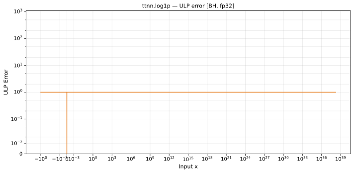

# log1p — Blackhole (BH), float32
_This page is auto-generated by `ttnn-accuracy report`. Do not edit manually._

**Architecture:** Blackhole (BH)  
**Data type:** float32  

---

[← Blackhole (BH) float32 ops](README.md) | [All archs for log1p](../../../by_op/log1p/README.md) | [Top](../../../README.md)

**Measured input range:** x ∈ [-1, 3.403e+38]  

|  | `default` |
|---|---|
| Max ULP | 0.967 |
| Min ULP | 0 |
| Mean ULP | 0.558 |
| Signed bias (ULP) | -0.461 |
| p50 ULP | 0.00303 |
| p95 ULP | 0.629 |
| p99 ULP | 0.67 |
| Exact fraction | 0.587 |
| Correctly rounded | 0.982 |
| Accurate to \|x\| | 3.39e+38 |
| Max abs error | 4.53e-06 |
| Max rel error | 8.79e-08 |
| Median rel error | 4.84e-08 |
| Bits of precision (worst) | 23.4 |
| Bits of precision (median) | 24.3 |

**default** — faithful; 20111/48640 tie-breaks  

**Outcomes**

| Parameters | exact | faithful |
|---|---|---|
| `default` | 28,529 | 20,111 |

**Worst points**

| Parameters | x | golden | device | ULP |
|---|---|---|---|---|
| `default` | 0.28323895 | 0.24938731 | 0.24938732 | 0.967 |
| `default` | 0.28193188 | 0.24836822 | 0.24836823 | 0.961 |
| `default` | -0.29687458 | -0.35222 | -0.35222003 | 0.955 |
| `default` | -0.6250494 | -0.980961 | -0.9809611 | 0.951 |
| `default` | -0.2939755 | -0.34810534 | -0.34810537 | 0.948 |
| `default` | -0.29257256 | -0.3461202 | -0.34612024 | 0.946 |
| `default` | 0.2773276 | 0.24477008 | 0.2447701 | 0.945 |
| `default` | 0.2804077 | 0.24717854 | 0.24717855 | 0.944 |
| `default` | 0.27757877 | 0.2449667 | 0.24496672 | 0.941 |
| `default` | -0.2898282 | -0.34224838 | -0.3422484 | 0.94 |

**Monotonicity**

_Checked only where the reference is itself ordered, and never across a discontinuity._

| Parameters | Pairs | Violations | Rate | Worst \|Δy\| |
|---|---|---|---|---|
| `default` | 48,638 | 0 | 0 | 0 |

### Special values

| Variant | x | device | golden |  |
|---|---|---|---|---|
| `default` | 0 | 0 | 0 | agree |
| `default` | -0 | 0 | -0 | **differ** |
| `default` | inf | inf | inf | agree |
| `default` | -inf | nan | nan | agree |
| `default` | nan | nan | nan | agree |
| `default` | 1.1754944e-38 | 1.1754944e-38 | 1.1754944e-38 | agree |
| `default` | -1.1754944e-38 | -1.1754944e-38 | -1.1754944e-38 | agree |

_Measured on BLACKHOLE · tt-metal `de546d3b146` · ttnn `0.79.0` · run `20261010T030214`_

