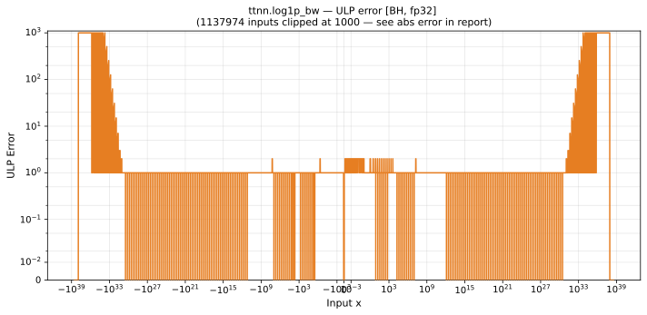

# log1p_bw — Blackhole (BH), float32
_This page is auto-generated by `ttnn-accuracy report`. Do not edit manually._

**Architecture:** Blackhole (BH)  
**Data type:** float32  

---

[← Blackhole (BH) float32 ops](README.md) | [All archs for log1p_bw](../../../by_op/log1p_bw/README.md) | [Top](../../../README.md)

**Measured input range:** x ∈ [-8.507e+37, 8.507e+37]  

|  | `default` |
|---|---|
| Max ULP | 9.02e+04 ⚠ |
| Min ULP | 0 |
| Mean ULP | 2.96e+03 |
| Signed bias (ULP) | -0.0333 |
| p50 ULP | 0.626 |
| p95 ULP | 1.04e+03 |
| p99 ULP | 5.59e+04 |
| Exact fraction | 0.42 |
| Correctly rounded | 0.89 |
| Accurate to \|x\| | 2.02e+31 |
| Max abs error | 6.19e-05 |
| Max rel error | 0.00558 |
| Median rel error | 6.37e-08 |
| Bits of precision (worst) | 7.48 |
| Bits of precision (median) | 23.9 |

**default** — 2 of 64514 points returned inf or zero where a value exists  

**Outcomes**

| Parameters | exact | faithful | inexact | zeroed |
|---|---|---|---|---|
| `default` | 27,072 | 29,402 | 8,038 | 2 |

**Worst points**

| Parameters | x | golden | device | ULP |
|---|---|---|---|---|
| `default` | 6.905755e+35 | 1.4480677e-36 | 1.4399806e-36 | 9.02e+04 |
| `default` | 1.381151e+36 | 7.2403383e-37 | 7.199903e-37 | 9.02e+04 |
| `default` | 2.762302e+36 | 3.6201692e-37 | 3.5999514e-37 | 9.02e+04 |
| `default` | 5.524604e+36 | 1.8100846e-37 | 1.7999757e-37 | 9.02e+04 |
| `default` | 1.1049208e+37 | 9.050423e-38 | 8.9998786e-38 | 9.02e+04 |
| `default` | 2.2098415e+37 | 4.5252114e-38 | 4.4999393e-38 | 9.02e+04 |
| `default` | 4.419683e+37 | 2.2626057e-38 | 2.2499697e-38 | 9.02e+04 |
| `default` | -6.905755e+35 | -1.4480677e-36 | -1.4399806e-36 | 9.02e+04 |
| `default` | -1.381151e+36 | -7.2403383e-37 | -7.199903e-37 | 9.02e+04 |
| `default` | -2.762302e+36 | -3.6201692e-37 | -3.5999514e-37 | 9.02e+04 |

**Monotonicity**

_Checked only where the reference is itself ordered, and never across a discontinuity._

| Parameters | Pairs | Violations | Rate | Worst \|Δy\| |
|---|---|---|---|---|
| `default` | 32,255 | 0 | 0 | 0 |

### Special values

| Variant | x | device | golden |  |
|---|---|---|---|---|
| `default` | 0 | 1 | 1 | agree |
| `default` | -0 | 1 | 1 | agree |
| `default` | inf | 0 | 0 | agree |
| `default` | -inf | 0 | -0 | **differ** |
| `default` | nan | 0 | nan | **differ** |
| `default` | 1.1754944e-38 | 1 | 1 | agree |
| `default` | -1.1754944e-38 | 1 | 1 | agree |

_Measured on BLACKHOLE · tt-metal `a3a9fb4229a` · ttnn `0.78.0` · run `20260918T102923`_

