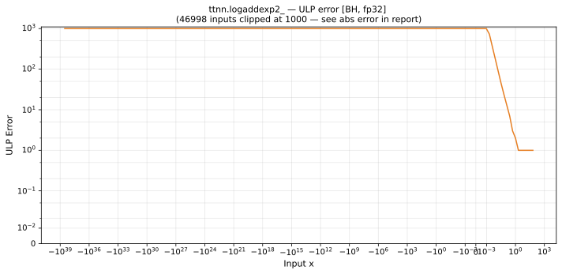

# logaddexp2_ — Blackhole (BH), float32
_This page is auto-generated by `ttnn-accuracy report`. Do not edit manually._

**Architecture:** Blackhole (BH)  
**Data type:** float32  

---

[← Blackhole (BH) float32 ops](README.md) | [All archs for logaddexp2_](../../../by_op/logaddexp2_/README.md) | [Top](../../../README.md)

**Measured input range:** all normal values  

|  | `default` |
|---|---|
| Max ULP | 1.54e+09 ⚠ |
| Mean ULP | 1.05e+07 |
| Max abs error | 7.63e-06 |

**default** — 15488 of 65024 points returned inf or zero where a value exists  

**Outcomes**

| Parameters | exact | inexact | mismatch |
|---|---|---|---|
| `default` | 108 | 49,428 | 15,488 |

### Special values

| Variant | x | device | golden |  |
|---|---|---|---|---|
| `default` | 0 | 1.585 | 1.585 | agree |
| `default` | -0 | 1.585 | 1.585 | agree |
| `default` | inf | inf | inf | agree |
| `default` | -inf | 1 | 1 | agree |
| `default` | nan | nan | nan | agree |
| `default` | 1.175e-38 | 1.585 | 1.585 | agree |
| `default` | -1.175e-38 | 1.585 | 1.585 | agree |

> **Sampled, not exhaustive.** For this op both operands take 65,536 of the 2³² fp32 values, drawn once from a fixed seed. The figures above are a lower bound on the error, and comparable between releases, but they are not a bound over the dtype.

_Measured on BLACKHOLE · tt-metal `fbf7d27db93` · ttnn `0.75.0rc10.dev916+ga5cd86212e1` · run `20260903T150812`_

