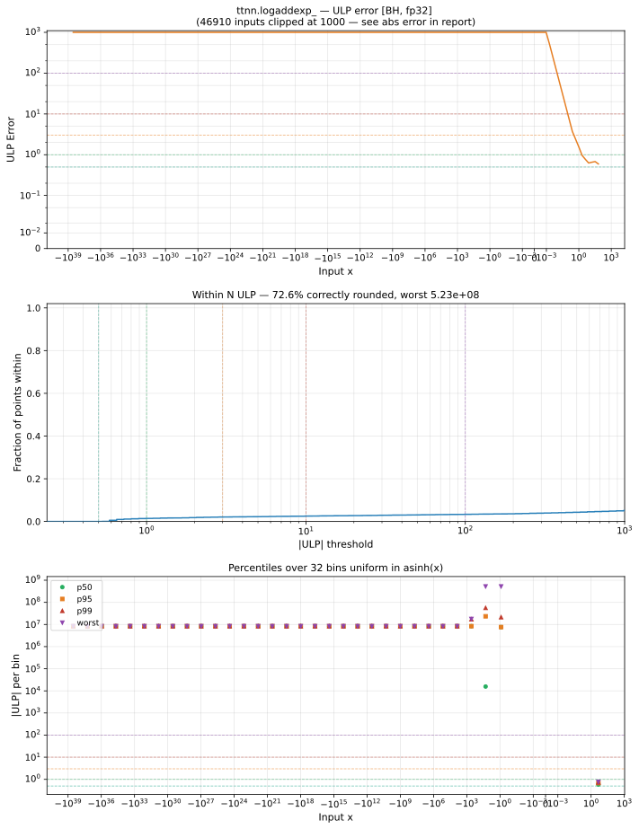

# logaddexp_ — Blackhole (BH), float32
_This page is auto-generated by `ttnn-accuracy report`. Do not edit manually._

**Architecture:** Blackhole (BH)  
**Data type:** float32  

---

[← Blackhole (BH) float32 ops](README.md) | [All archs for logaddexp_](../../../by_op/logaddexp_/README.md) | [Top](../../../README.md)

**Measured input range:** all normal values  

|  | `default` |
|---|---|
| Max ULP | 5.23e+08 ⚠ |
| Min ULP | 0.474 |
| Mean ULP | 7.28e+06 |
| Signed bias (ULP) | -6.43e+06 |
| p50 ULP | 7.6e+06 |
| p95 ULP | 8.38e+06 |
| p99 ULP | 1.98e+07 |
| Exact fraction | 0.000101 |
| Correctly rounded | 0.726 |
| Max abs error | 4.53e-06 |
| Max rel error | 38.7 |
| Median rel error | 0.828 |
| Bits of precision (worst) | -5.27 |
| Bits of precision (median) | 0.273 |

**default** — 15566/65024 defects; rest 5.23e+08 ULP  

**Outcomes**

| Parameters | exact | faithful | inexact | mismatch |
|---|---|---|---|---|
| `default` | 5 | 710 | 48,743 | 15,566 |

**Worst points**

| Parameters | x | x2 | golden | device | ULP |
|---|---|---|---|---|---|
| `default` | -8.977986e-08 | -16.242775 | -1.5018606e-09 | -5.9604645e-08 | 5.23e+08 |
| `default` | -16.242775 | -8.977986e-08 | -1.5018606e-09 | -5.9604645e-08 | 5.23e+08 |
| `default` | -8.993538e-08 | -16.242775 | -1.657377e-09 | -5.9604645e-08 | 5.22e+08 |
| `default` | -9.050976e-08 | -16.242775 | -2.2317583e-09 | -5.9604645e-08 | 2.58e+08 |
| `default` | -2.995567e-08 | -17.420351 | -2.763889e-09 | -5.9604645e-08 | 2.56e+08 |
| `default` | -17.420351 | -2.995567e-08 | -2.763889e-09 | -5.9604645e-08 | 2.56e+08 |
| `default` | -3.006284e-08 | -17.420351 | -2.8710565e-09 | -5.9604645e-08 | 2.56e+08 |
| `default` | -9.124095e-08 | -16.242775 | -2.9629494e-09 | -5.9604645e-08 | 2.55e+08 |
| `default` | -3.0428126e-08 | -17.420351 | -3.236343e-09 | -5.9604645e-08 | 2.54e+08 |
| `default` | -9.1639315e-08 | -16.242775 | -3.3613152e-09 | -5.9604645e-08 | 2.53e+08 |

**Non-finite outputs**

| Parameters | Points | Both | Device only | Golden only | Device inf | Device nan | Golden inf | Golden nan |
|---|---|---|---|---|---|---|---|---|
| `default` | 15,566 | 0 | 15,566 | 0 | 15,566 | 0 | 0 | 0 |

| Parameters | x | x2 | golden | device |
|---|---|---|---|---|
| `default` | 89.075935 | 1.1837498e-38 | 89.075935 | inf |
| `default` | 89.91161 | 1.1837498e-38 | 89.91161 | inf |
| `default` | 90.06322 | 1.1837498e-38 | 90.06322 | inf |
| `default` | 90.557945 | 1.1837498e-38 | 90.557945 | inf |
| `default` | 91.167274 | 1.1837498e-38 | 91.167274 | inf |
| `default` | 91.74033 | 1.1837498e-38 | 91.74033 | inf |
| `default` | 92.07601 | 1.1837498e-38 | 92.07601 | inf |
| `default` | 92.5875 | 1.1837498e-38 | 92.5875 | inf |
| `default` | 93.10285 | 1.1837498e-38 | 93.10285 | inf |
| `default` | 93.64929 | 1.1837498e-38 | 93.64929 | inf |

### Special values

| Variant | x | device | golden |  |
|---|---|---|---|---|
| `default` | 0 | 1.3132616 | 1.3132616 | agree |
| `default` | -0 | 1.3132616 | 1.3132616 | agree |
| `default` | inf | inf | inf | agree |
| `default` | -inf | 1 | 1 | agree |
| `default` | nan | nan | nan | agree |
| `default` | 1.1754944e-38 | 1.3132616 | 1.3132616 | agree |
| `default` | -1.1754944e-38 | 1.3132616 | 1.3132616 | agree |

> **Sampled, not exhaustive.** For this op both operands take 65,536 of the 2³² fp32 values, drawn once from a fixed seed. The figures above are a lower bound on the error, and comparable between releases, but they are not a bound over the dtype.

> **Provenance unknown.** These figures predate run tracking. Re-measure to attribute them.

