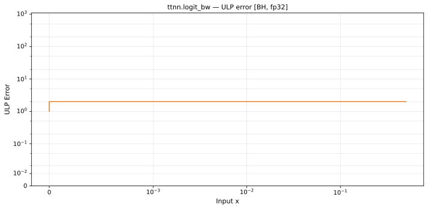

# logit_bw — Blackhole (BH), float32
_This page is auto-generated by `ttnn-accuracy report`. Do not edit manually._

**Architecture:** Blackhole (BH)  
**Data type:** float32  

---

[← Blackhole (BH) float32 ops](README.md) | [All archs for logit_bw](../../../by_op/logit_bw/README.md) | [Top](../../../README.md)

**Measured input range:** x ∈ [min\_normal, 1]  

|  | `default` |
|---|---|
| Max ULP | 2.28 |
| Min ULP | 0.502 |
| Mean ULP | 0.789 |
| Signed bias (ULP) | 0.346 |
| p50 ULP | 0.67 |
| p95 ULP | 1.53 |
| p99 ULP | 1.94 |
| Exact fraction | 0 |
| Correctly rounded | 0.874 |
| Accurate to \|x\| | 2.97e-08 |
| Max abs error | 3.77e+30 |
| Max rel error | 1.57e-07 |
| Median rel error | 6.21e-08 |
| Bits of precision (worst) | 22.6 |
| Bits of precision (median) | 23.9 |

**default** — accurate to |x| <= 2.97e-08  

**Outcomes**

| Parameters | faithful | inexact |
|---|---|---|
| `default` | 13,515 | 2,613 |

**Worst points**

| Parameters | x | golden | device | ULP |
|---|---|---|---|---|
| `default` | 0.14706358 | 7.9722004 | 7.9722013 | 2.28 |
| `default` | 0.14768693 | 7.944358 | 7.944359 | 2.28 |
| `default` | 0.14891341 | 7.8902802 | 7.8902793 | 2.26 |
| `default` | 2.983257e-08 | 33520412 | 33520416 | 2.23 |
| `default` | 0.15023956 | 7.832839 | 7.83284 | 2.21 |
| `default` | 3.003781e-08 | 33291376 | 33291380 | 2.2 |
| `default` | 0.151077 | 7.7971044 | 7.7971053 | 2.18 |
| `default` | 0.06903234 | 15.560115 | 15.560113 | 2.17 |
| `default` | 0.15182057 | 7.7657185 | 7.7657175 | 2.17 |
| `default` | 3.027281e-08 | 33032946 | 33032950 | 2.17 |

### Special values

| Variant | x | device | golden |  |
|---|---|---|---|---|
| `default` | 0 | inf | inf | agree |
| `default` | -0 | inf | -inf | **differ** |
| `default` | inf | nan | nan | agree |
| `default` | -inf | nan | nan | agree |
| `default` | nan | nan | nan | agree |
| `default` | 1.1754944e-38 | 8.507059e+37 | 8.507059e+37 | agree |
| `default` | -1.1754944e-38 | nan | nan | agree |

_Measured on BLACKHOLE · tt-metal `de546d3b146` · ttnn `0.79.0` · run `20261003T030219`_

