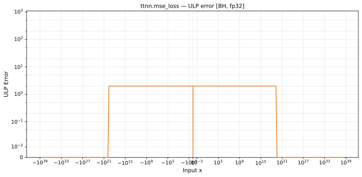

# mse_loss — Blackhole (BH), float32
_This page is auto-generated by `ttnn-accuracy report`. Do not edit manually._

**Architecture:** Blackhole (BH)  
**Data type:** float32  

---

[← Blackhole (BH) float32 ops](README.md) | [All archs for mse_loss](../../../by_op/mse_loss/README.md) | [Top](../../../README.md)

**Measured input range:** all normal values  

|  | `default` |
|---|---|
| Max ULP | 2 |
| Mean ULP | 1.94 |
| Max abs error | 2.03e+31 |

**default** — within 2 ULP everywhere  

**Outcomes**

| Parameters | exact | inexact |
|---|---|---|
| `default` | 23,863 | 41,161 |

### Special values

| Variant | x | device | golden |  |
|---|---|---|---|---|
| `default` | 0 | 1 | 1 | agree |
| `default` | -0 | 1 | 1 | agree |
| `default` | inf | inf | inf | agree |
| `default` | -inf | inf | inf | agree |
| `default` | nan | nan | nan | agree |
| `default` | 1.175e-38 | 1 | 1 | agree |
| `default` | -1.175e-38 | 1 | 1 | agree |

> **Sampled, not exhaustive.** For this op both operands take 65,536 of the 2³² fp32 values, drawn once from a fixed seed. The figures above are a lower bound on the error, and comparable between releases, but they are not a bound over the dtype.

_Measured on BLACKHOLE · tt-metal `fbf7d27db93` · ttnn `0.75.0rc10.dev916+ga5cd86212e1` · run `20260903T150812`_

