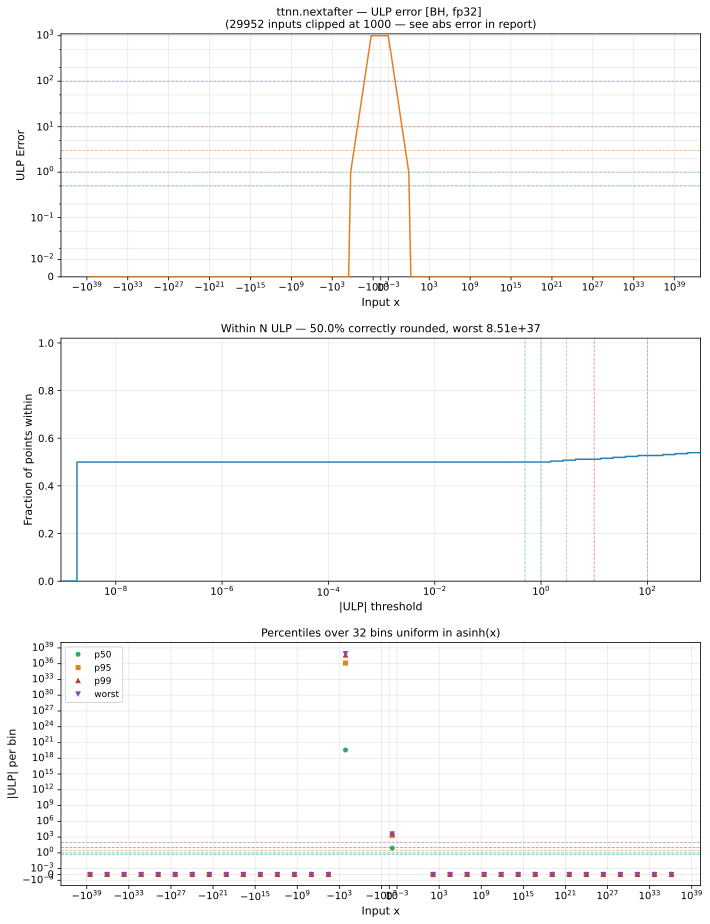

# nextafter — Blackhole (BH), float32
_This page is auto-generated by `ttnn-accuracy report`. Do not edit manually._

**Architecture:** Blackhole (BH)  
**Data type:** float32  

---

[← Blackhole (BH) float32 ops](README.md) | [All archs for nextafter](../../../by_op/nextafter/README.md) | [Top](../../../README.md)

**Measured input range:** all normal values  

| Parameters | Max ULP | Mean ULP | Max abs error |
|------------|---------|----------|---------------|
| `default` | 8.51e+37 ⚠ | 1.34e+36 | 1.19e-07 |

**default** — worst pairing 8.51e+37 ULP; mean 1.34e+36  

**Outcomes**

| Parameters | exact | inexact |
|------------|------|------|
| `default` | 32,512 | 32,512 |

### Special values

| Variant | x | device | golden | |
|---|---|---|---|---|
| `default` | 0 | -1.192e-07 | 0 | **differ** |
| `default` | -0 | -1.192e-07 | 0 | **differ** |
| `default` | inf | inf | inf | agree |
| `default` | -inf | -inf | -inf | agree |
| `default` | nan | nan | nan | agree |
| `default` | 1.175e-38 | -1.192e-07 | 1.175e-38 | **differ** |
| `default` | -1.175e-38 | -1.192e-07 | -1.175e-38 | **differ** |

> **Sampled, not exhaustive.** For this op both operands take 65,536 of the 2³² fp32 values, drawn once from a fixed seed. The figures above are a lower bound on the error, and comparable between releases, but they are not a bound over the dtype.

_Measured on BLACKHOLE · tt-metal `72023534b03` · ttnn `0.75.0rc10.dev916+ga5cd86212e1` · run `20260903T103548`_

