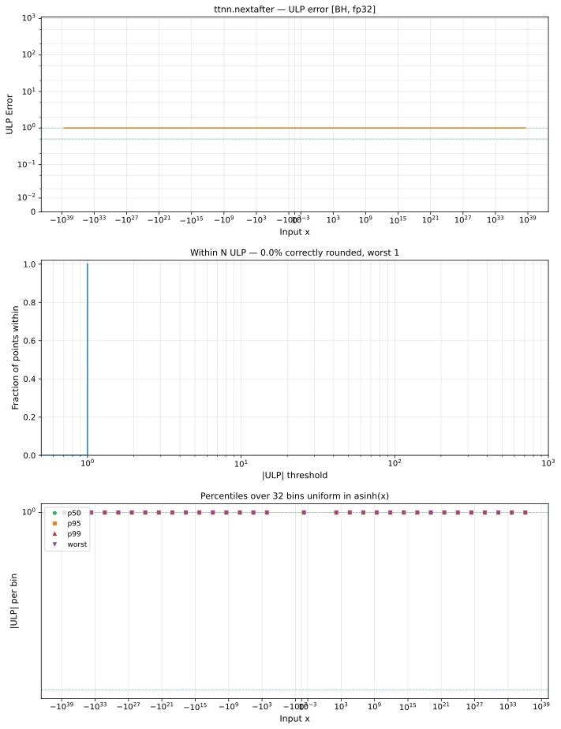

# nextafter — Blackhole (BH), float32
_This page is auto-generated by `ttnn-accuracy report`. Do not edit manually._

**Architecture:** Blackhole (BH)  
**Data type:** float32  

---

[← Blackhole (BH) float32 ops](README.md) | [All archs for nextafter](../../../by_op/nextafter/README.md) | [Top](../../../README.md)

**Measured input range:** all normal values  

|  | `default` |
|---|---|
| Max ULP | 1 |
| Min ULP | 1 |
| Mean ULP | 1 |
| Signed bias (ULP) | -3.08e-05 |
| p50 ULP | 1 |
| p95 ULP | 1 |
| p99 ULP | 1 |
| Exact fraction | 0 |
| Correctly rounded | 1.54e-05 |
| Max abs error | 2.03e+31 |
| Max rel error | 1.19e-07 |
| Median rel error | 7.95e-08 |
| Bits of precision (worst) | 23 |
| Bits of precision (median) | 23.6 |

**default** — faithful; 65024/65024 tie-breaks  

**Outcomes**

| Parameters | faithful |
|---|---|
| `default` | 65,024 |

**Worst points**

| Parameters | x | x2 | golden | device | ULP |
|---|---|---|---|---|---|
| `default` | 1.1837498e-38 | 1.187421e-38 | 1.1837498e-38 | 1.18375e-38 | 1 |
| `default` | 1.187421e-38 | 1.1837498e-38 | 1.187421e-38 | 1.1874208e-38 | 1 |
| `default` | 1.2021456e-38 | 1.1837498e-38 | 1.2021456e-38 | 1.2021455e-38 | 1 |
| `default` | 1.2092162e-38 | 1.1837498e-38 | 1.2092162e-38 | 1.209216e-38 | 1 |
| `default` | 1.2204055e-38 | 1.1837498e-38 | 1.2204055e-38 | 1.2204054e-38 | 1 |
| `default` | 1.2232443e-38 | 1.1837498e-38 | 1.2232443e-38 | 1.2232442e-38 | 1 |
| `default` | 1.237559e-38 | 1.1837498e-38 | 1.237559e-38 | 1.2375588e-38 | 1 |
| `default` | 1.2484311e-38 | 1.1837498e-38 | 1.2484311e-38 | 1.248431e-38 | 1 |
| `default` | 1.2494089e-38 | 1.1837498e-38 | 1.2494089e-38 | 1.2494088e-38 | 1 |
| `default` | 1.2614992e-38 | 1.1837498e-38 | 1.2614992e-38 | 1.261499e-38 | 1 |

### Special values

| Variant | x | device | golden |  |
|---|---|---|---|---|
| `default` | 0 | 0 | 0 | agree |
| `default` | -0 | 0 | 0 | agree |
| `default` | inf | 3.4028235e+38 | inf | **differ** |
| `default` | -inf | -3.4028235e+38 | -inf | **differ** |
| `default` | nan | nan | nan | agree |
| `default` | 1.1754944e-38 | 1.1754945e-38 | 1.1754944e-38 | **differ** |
| `default` | -1.1754944e-38 | -0 | -1.1754944e-38 | **differ** |

> **Sampled, not exhaustive.** For this op both operands take 65,536 of the 2³² fp32 values, drawn once from a fixed seed. The figures above are a lower bound on the error, and comparable between releases, but they are not a bound over the dtype.

_Measured on BLACKHOLE · tt-metal `978f93b56e3` · ttnn `0.80.0` · run `20261017T025047`_

