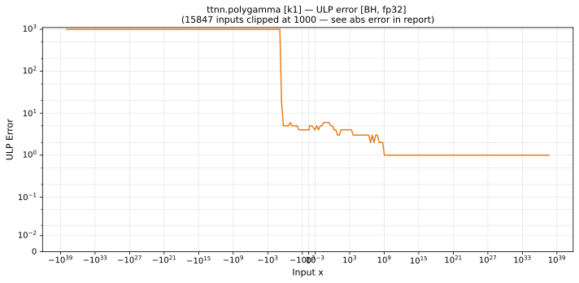
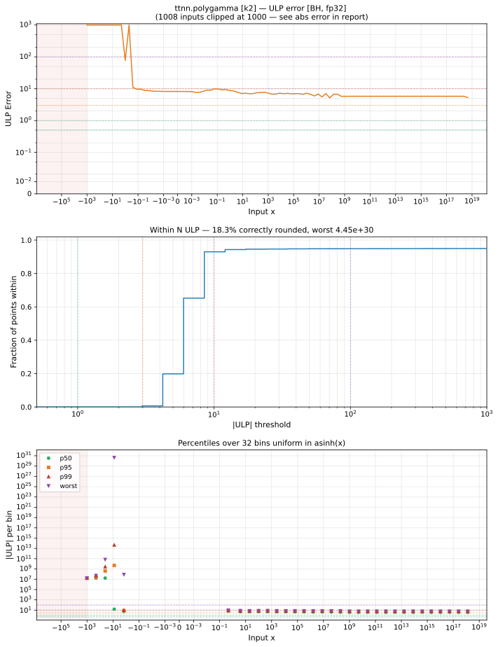
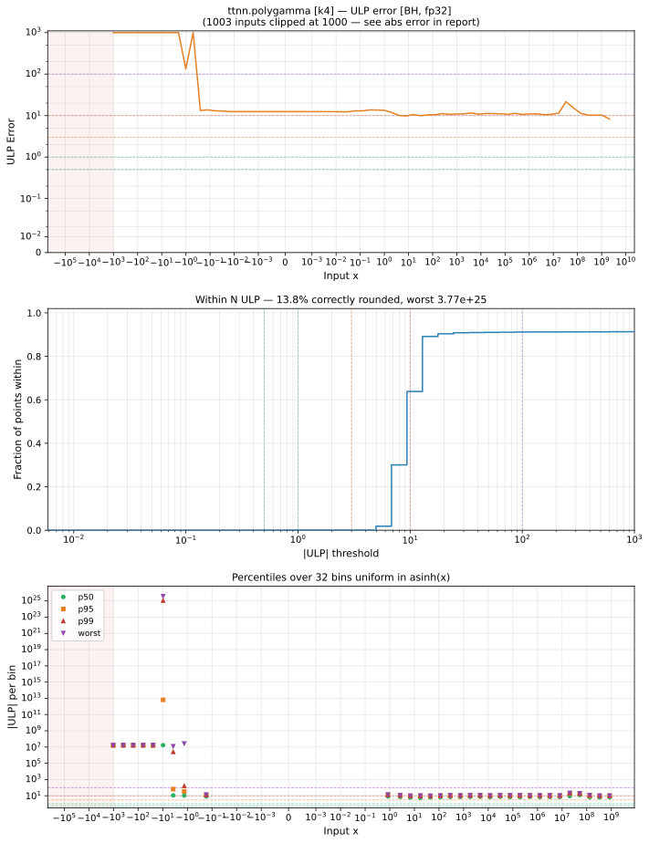

# polygamma — Blackhole (BH), float32
_This page is auto-generated by `ttnn-accuracy report`. Do not edit manually._

**Architecture:** Blackhole (BH)  
**Data type:** float32  

---

[← Blackhole (BH) float32 ops](README.md) | [All archs for polygamma](../../../by_op/polygamma/README.md) | [Top](../../../README.md)

**Measured input range:** x ≥ -1024  

|  | `k=1` | `k=2` | `k=4` |
|---|---|---|---|
| Max ULP | 7.91e+33 ⚠ | 4.45e+30 ⚠ | 3.77e+25 ⚠ |
| Min ULP | 0 | 2.09 | 0.0117 |
| Mean ULP | 4.68e+29 | 4.42e+26 | 6.51e+21 |
| Signed bias (ULP) | 4.35e+05 | 4.42e+26 | 6.51e+21 |
| p50 ULP | 2.48 | 5.23 | 8.23 |
| p95 ULP | 4.48 | 1.44e+03 | 1.68e+07 |
| p99 ULP | 1.68e+07 | 1.68e+07 | 1.68e+07 |
| Exact fraction | 2.96e-05 | 0 | 8.63e-05 |
| Correctly rounded | 0.467 | 0.183 | 0.138 |
| Accurate to \|x\| | 5.4e-20 | 1.79e-13 | 3.68e-08 |
| Max abs error | 2.59e+38 | 2.99e+38 | 3.32e+38 |
| Max rel error | 9.43e+26 | 2.85e+23 | 2.63e+18 |
| Median rel error | 2.23e-07 | 4.69e-07 | 6.63e-07 |
| Bits of precision (worst) | -89.6 | -77.9 | -61.2 |
| Bits of precision (median) | 22.1 | 21 | 20.5 |

**k=1** — 1 of 49922 points returned inf or zero where a value exists · _trigamma, the first order in use_  
**k=2** — 75 of 49922 points returned inf or zero where a value exists · _tetragamma; the order changes the series, not just a constant_  
**k=4** — 141 of 49922 points returned inf or zero where a value exists · _high enough that the reference and the kernel can diverge_  

**Outcomes**

| Parameters | exact | faithful | flushed | inexact | mismatch | overflow | zeroed |
|---|---|---|---|---|---|---|---|
| `k=1` | 1 | 196 | 255 | 33,597 | 0 | 15,872 | 1 |
| `k=2` | 0 | 0 | 8,319 | 20,128 | 2 | 21,398 | 75 |
| `k=4` | 1 | 0 | 12,274 | 11,586 | 2 | 25,918 | 141 |

**Worst points**

| Parameters | x | golden | device | ULP |
|---|---|---|---|---|
| `k=1` | -5.999998 | 2.748779e+11 | 2.5926276e+38 | 7.91e+33 |
| `k=1` | -6.000002 | 2.748779e+11 | -2.5926276e+38 | 7.91e+33 |
| `k=1` | -6.031298 | 1023.99445 | -808212500 | 1.32e+13 |
| `k=1` | -5.968702 | 1023.993 | 808213500 | 1.32e+13 |
| `k=1` | -5.9371104 | 255.99886 | 6086207.5 | 3.99e+11 |
| `k=1` | -6.06289 | 255.99799 | -6085626 | 3.99e+11 |
| `k=1` | -6.09375 | 116.974144 | -369621.1 | 4.85e+10 |
| `k=1` | -5.9062495 | 116.968575 | 369724.44 | 4.84e+10 |
| `k=1` | -6.128299 | 63.99978 | -40704.766 | 1.07e+10 |
| `k=1` | -5.871707 | 63.9996 | 40782.48 | 1.07e+10 |
| `k=2` | -5.9999876 | -1.0495416e+15 | -2.9860802e+38 | 4.45e+30 |
| `k=2` | -6.0000124 | 1.0495416e+15 | -2.9860802e+38 | 4.45e+30 |
| `k=2` | -5.4998584 | 1.0778606e-06 | -35.088436 | 3.09e+14 |
| `k=2` | -6.03125 | 65535.57 | -1.8307349e+11 | 4.69e+13 |
| `k=2` | -5.9687495 | -65532.617 | -1.8305127e+11 | 4.69e+13 |
| `k=2` | -6.4998956 | 3.849165e-05 | -35.252666 | 9.69e+12 |
| `k=2` | -6.0625 | 8191.1553 | -713060700 | 1.46e+12 |
| `k=2` | -5.9374995 | -8191.0146 | -713025340 | 1.46e+12 |
| `k=2` | -6.099191 | 2047.9728 | -17614672 | 1.44e+11 |
| `k=2` | -5.9008083 | -2047.9902 | -17616042 | 1.44e+11 |
| `k=4` | -5.9998198 | -1.2615422e+20 | -3.3156e+38 | 3.77e+25 |
| `k=4` | -6.0001802 | 1.2615422e+20 | -3.3156e+38 | 3.77e+25 |
| `k=4` | -6.03125 | 805306400 | -1.3503113e+16 | 2.11e+14 |
| `k=4` | -5.9687495 | -805244900 | -1.3501061e+16 | 2.11e+14 |
| `k=4` | -6.5 | -0.002457483 | -10844.527 | 4.66e+13 |
| `k=4` | -5.4999995 | 0.0028088856 | -10844.416 | 4.66e+13 |
| `k=4` | -6.4999995 | 0.004877334 | -10844.634 | 2.33e+13 |
| `k=4` | -5.5 | -0.00452593 | -10844.529 | 2.33e+13 |
| `k=4` | -6.0625 | 25165808 | -1.316423e+13 | 6.58e+12 |
| `k=4` | -5.9374995 | -25164848 | -1.3163251e+13 | 6.58e+12 |

**Monotonicity**

_Checked only where the reference is itself ordered, and never across a discontinuity._

| Parameters | Pairs | Violations | Rate | Worst \|Δy\| |
|---|---|---|---|---|
| `k=1` | 24,319 | 0 | 0 | 0 |
| `k=2` | 13,418 | 0 | 0 | 0 |
| `k=4` | 7,137 | 0 | 0 | 0 |

**Non-finite outputs**

| Parameters | Points | Both | Device only | Golden only | Device inf | Device nan | Golden inf | Golden nan |
|---|---|---|---|---|---|---|---|---|
| `k=1` | 15,872 | 15,872 | 0 | 0 | 15,872 | 0 | 15,872 | 0 |
| `k=2` | 21,400 | 21,398 | 0 | 2 | 21,398 | 0 | 21,399 | 1 |
| `k=4` | 25,920 | 25,918 | 0 | 2 | 25,918 | 0 | 25,919 | 1 |

| Parameters | x | golden | device |
|---|---|---|---|
| `k=1` | 1.1754944e-38 | inf | inf |
| `k=1` | 1.1846779e-38 | inf | inf |
| `k=1` | 1.1938615e-38 | inf | inf |
| `k=1` | 1.203045e-38 | inf | inf |
| `k=1` | 1.2122285e-38 | inf | inf |
| `k=1` | 1.2214121e-38 | inf | inf |
| `k=1` | 1.2305956e-38 | inf | inf |
| `k=1` | 1.2397792e-38 | inf | inf |
| `k=1` | 1.2489627e-38 | inf | inf |
| `k=1` | 1.2581463e-38 | inf | inf |
| `k=2` | 1.1754944e-38 | -inf | -inf |
| `k=2` | 1.1846779e-38 | -inf | -inf |
| `k=2` | 1.1938615e-38 | -inf | -inf |
| `k=2` | 1.203045e-38 | -inf | -inf |
| `k=2` | 1.2122285e-38 | -inf | -inf |
| `k=2` | 1.2214121e-38 | -inf | -inf |
| `k=2` | 1.2305956e-38 | -inf | -inf |
| `k=2` | 1.2397792e-38 | -inf | -inf |
| `k=2` | 1.2489627e-38 | -inf | -inf |
| `k=2` | 1.2581463e-38 | -inf | -inf |
| `k=4` | 1.1754944e-38 | -inf | -inf |
| `k=4` | 1.1846779e-38 | -inf | -inf |
| `k=4` | 1.1938615e-38 | -inf | -inf |
| `k=4` | 1.203045e-38 | -inf | -inf |
| `k=4` | 1.2122285e-38 | -inf | -inf |
| `k=4` | 1.2214121e-38 | -inf | -inf |
| `k=4` | 1.2305956e-38 | -inf | -inf |
| `k=4` | 1.2397792e-38 | -inf | -inf |
| `k=4` | 1.2489627e-38 | -inf | -inf |
| `k=4` | 1.2581463e-38 | -inf | -inf |

### Special values

| Variant | x | device | golden |  |
|---|---|---|---|---|
| `k=1` | 0 | inf | inf | agree |
| `k=1` | -0 | inf | inf | agree |
| `k=1` | inf | 0 | 0 | agree |
| `k=1` | -inf | 0 | nan | **differ** |
| `k=1` | nan | 0 | nan | **differ** |
| `k=1` | 1.1754944e-38 | inf | inf | agree |
| `k=1` | -1.1754944e-38 | inf | inf | agree |
| `k=2` | 0 | -inf | -inf | agree |
| `k=2` | -0 | -inf | -inf | agree |
| `k=2` | inf | 0 | nan | **differ** |
| `k=2` | -inf | 0 | -inf | **differ** |
| `k=2` | nan | 0 | nan | **differ** |
| `k=2` | 1.1754944e-38 | -inf | -inf | agree |
| `k=2` | -1.1754944e-38 | inf | inf | agree |
| `k=4` | 0 | -inf | -inf | agree |
| `k=4` | -0 | -inf | -inf | agree |
| `k=4` | inf | 0 | nan | **differ** |
| `k=4` | -inf | 0 | -inf | **differ** |
| `k=4` | nan | 0 | nan | **differ** |
| `k=4` | 1.1754944e-38 | -inf | -inf | agree |
| `k=4` | -1.1754944e-38 | inf | inf | agree |

_Measured on BLACKHOLE · tt-metal `a3a9fb4229a` · ttnn `0.78.0` · run `20260918T102923`_

### `k=1`

### `k=2`

### `k=4`

