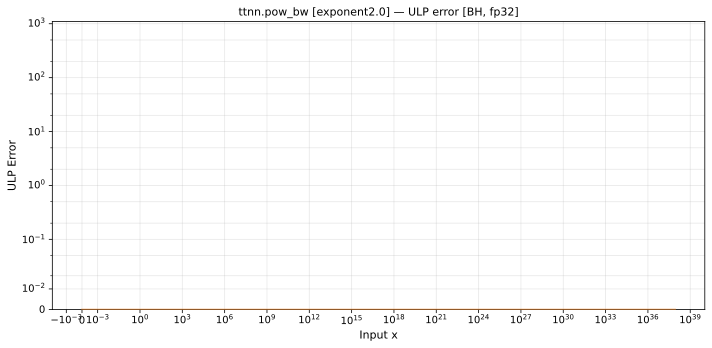

# pow_bw — Blackhole (BH), float32
_This page is auto-generated by `ttnn-accuracy report`. Do not edit manually._

**Architecture:** Blackhole (BH)  
**Data type:** float32  

---

[← Blackhole (BH) float32 ops](README.md) | [All archs for pow_bw](../../../by_op/pow_bw/README.md) | [Top](../../../README.md)

**Measured input range:** x ∈ [0, 1.701e+38]  

|  | `exponent=2.0` |
|---|---|
| Max ULP | 0 |
| Min ULP | 0 |
| Mean ULP | 0 |
| Signed bias (ULP) | 0 |
| p50 ULP | 0 |
| p95 ULP | 0 |
| p99 ULP | 0 |
| Exact fraction | 1 |
| Correctly rounded | 1 |
| Accurate to \|x\| | 1.69e+38 |
| Max abs error | 0 |
| Max rel error | 0 |
| Median rel error | 0 |
| Bits of precision (worst) | — |
| Bits of precision (median) | — |

**exponent=2.0** — bit-exact · _squaring_  

**Outcomes**

| Parameters | exact |
|---|---|
| `exponent=2.0` | 32,384 |

**Monotonicity**

_Checked only where the reference is itself ordered, and never across a discontinuity._

| Parameters | Pairs | Violations | Rate | Worst \|Δy\| |
|---|---|---|---|---|
| `exponent=2.0` | 32,383 | 0 | 0 | 0 |

### Special values

| Variant | x | device | golden |  |
|---|---|---|---|---|
| `exponent=2.0` | 0 | inf | 0 | **differ** |
| `exponent=2.0` | -0 | inf | -0 | **differ** |
| `exponent=2.0` | inf | inf | inf | agree |
| `exponent=2.0` | -inf | inf | inf | agree |
| `exponent=2.0` | nan | nan | nan | agree |
| `exponent=2.0` | 1.1754944e-38 | 2.3509887e-38 | 2.3509887e-38 | agree |
| `exponent=2.0` | -1.1754944e-38 | inf | inf | agree |

_Measured on BLACKHOLE · tt-metal `a3a9fb4229a` · ttnn `0.78.0` · run `20260918T102923`_

