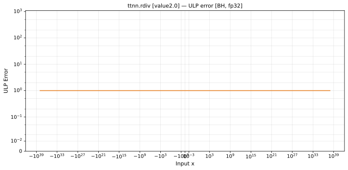

# rdiv — Blackhole (BH), float32
_This page is auto-generated by `ttnn-accuracy report`. Do not edit manually._

_Generated: 2026-09-02 14:00_

**Architecture:** Blackhole (BH)  
**Data type:** float32  

---

[← Blackhole (BH) float32 ops](README.md) | [All archs for rdiv](../../../by_op/rdiv/README.md) | [Top](../../../README.md)

**Measured input range:** x ∈ [-1.701e+38, 1.701e+38]  

| Parameters | Max ULP | Mean ULP | Accurate to \|x\| | Max abs error |
|---|---|---|---|---------------|
| `value=2.0` | 1 | 1 | 1.7e+38 | 1.01e+31 |

**value=2.0** — within 2 ULP everywhere · _2 keeps the op distinct from reciprocal_  

**Outcomes**

| Parameters | inexact | zeroed |
|------------|------|------|
| `value=2.0` | 64,512 | 258 |

### Special values

| Variant | x | device | golden | |
|---|---|---|---|---|
| `value=2.0` | 0 | inf | inf | agree |
| `value=2.0` | -0 | -inf | -inf | agree |
| `value=2.0` | inf | 0 | 0 | agree |
| `value=2.0` | -inf | 0 | -0 | **differ** |
| `value=2.0` | nan | 0 | nan | **differ** |
| `value=2.0` | 1.175e-38 | 1.701e+38 | 1.701e+38 | agree |
| `value=2.0` | -1.175e-38 | -1.701e+38 | -1.701e+38 | agree |

_Measured on BLACKHOLE · tt-metal `f9377427c7f` · ttnn `0.75.0rc10.dev916+ga5cd86212e1` · run `20260901T134349`_

