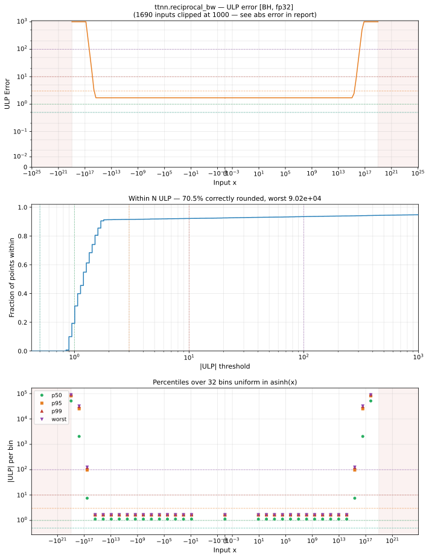

# reciprocal_bw — Blackhole (BH), float32
_This page is auto-generated by `ttnn-accuracy report`. Do not edit manually._

**Architecture:** Blackhole (BH)  
**Data type:** float32  

---

[← Blackhole (BH) float32 ops](README.md) | [All archs for reciprocal_bw](../../../by_op/reciprocal_bw/README.md) | [Top](../../../README.md)

**Measured input range:** x ∈ [-9.223e+18, 9.223e+18]  

|  | `default` |
|---|---|
| Max ULP | 9.02e+04 ⚠ |
| Min ULP | 0.846 |
| Mean ULP | 1.92e+03 |
| Signed bias (ULP) | -26.4 |
| p50 ULP | 1.17 |
| p95 ULP | 1.39e+03 |
| p99 ULP | 6.07e+04 |
| Exact fraction | 0 |
| Correctly rounded | 0.705 |
| Accurate to \|x\| | 5.42e-20 |
| Max abs error | 8.48e+30 |
| Max rel error | 0.00558 |
| Median rel error | 9.83e-08 |
| Bits of precision (worst) | 7.48 |
| Bits of precision (median) | 23.3 |

**default** — 256/48386 defects; rest 9.02e+04 ULP  

**Outcomes**

| Parameters | faithful | inexact | mismatch | overflow | zeroed |
|---|---|---|---|---|---|
| `default` | 10,114 | 22,142 | 254 | 15,874 | 2 |

**Worst points**

| Parameters | x | golden | device | ULP |
|---|---|---|---|---|
| `default` | 8.3100876e+17 | -1.4480675e-36 | -1.4399806e-36 | 9.02e+04 |
| `default` | 1.6620175e+18 | -3.6201687e-37 | -3.5999514e-37 | 9.02e+04 |
| `default` | 3.324035e+18 | -9.050422e-38 | -8.9998786e-38 | 9.02e+04 |
| `default` | 6.64807e+18 | -2.2626054e-38 | -2.2499697e-38 | 9.02e+04 |
| `default` | -8.3100876e+17 | -1.4480675e-36 | -1.4399806e-36 | 9.02e+04 |
| `default` | -1.6620175e+18 | -3.6201687e-37 | -3.5999514e-37 | 9.02e+04 |
| `default` | -3.324035e+18 | -9.050422e-38 | -8.9998786e-38 | 9.02e+04 |
| `default` | -6.64807e+18 | -2.2626054e-38 | -2.2499697e-38 | 9.02e+04 |
| `default` | 1.1752239e+18 | -7.2403374e-37 | -7.199903e-37 | 9.02e+04 |
| `default` | 2.3504477e+18 | -1.8100844e-37 | -1.7999757e-37 | 9.02e+04 |

**Monotonicity**

_Checked only where the reference is itself ordered, and never across a discontinuity._

| Parameters | Pairs | Violations | Rate | Worst \|Δy\| |
|---|---|---|---|---|
| `default` | 32,254 | 0 | 0 | 0 |

**Non-finite outputs**

| Parameters | Points | Both | Device only | Golden only | Device inf | Device nan | Golden inf | Golden nan |
|---|---|---|---|---|---|---|---|---|
| `default` | 16,128 | 15,874 | 254 | 0 | 16,128 | 0 | 15,874 | 0 |

| Parameters | x | golden | device |
|---|---|---|---|
| `default` | 1.1754944e-38 | -inf | -inf |
| `default` | 1.1846779e-38 | -inf | -inf |
| `default` | 1.1938615e-38 | -inf | -inf |
| `default` | 1.203045e-38 | -inf | -inf |
| `default` | 1.2122285e-38 | -inf | -inf |
| `default` | 1.2214121e-38 | -inf | -inf |
| `default` | 1.2305956e-38 | -inf | -inf |
| `default` | 1.2397792e-38 | -inf | -inf |
| `default` | 1.2489627e-38 | -inf | -inf |
| `default` | 1.2581463e-38 | -inf | -inf |

### Special values

| Variant | x | device | golden |  |
|---|---|---|---|---|
| `default` | 0 | -inf | -inf | agree |
| `default` | -0 | -inf | -inf | agree |
| `default` | inf | 0 | -0 | **differ** |
| `default` | -inf | 0 | -0 | **differ** |
| `default` | nan | 0 | nan | **differ** |
| `default` | 1.1754944e-38 | -inf | -inf | agree |
| `default` | -1.1754944e-38 | -inf | -inf | agree |

> **Provenance unknown.** These figures predate run tracking. Re-measure to attribute them.

