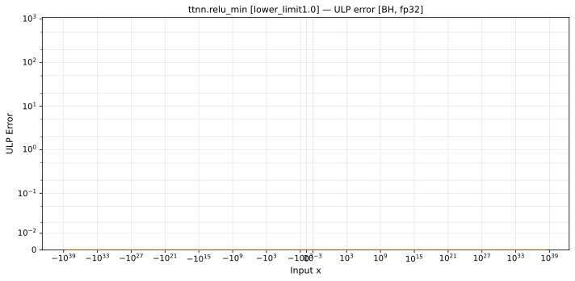

# relu_min — Blackhole (BH), float32
_This page is auto-generated by `ttnn-accuracy report`. Do not edit manually._

**Architecture:** Blackhole (BH)  
**Data type:** float32  

---

[← Blackhole (BH) float32 ops](README.md) | [All archs for relu_min](../../../by_op/relu_min/README.md) | [Top](../../../README.md)

**Measured input range:** x ∈ [-3.403e+38, 3.403e+38]  

|  | `lower_limit=1.0` |
|---|---|
| Max ULP | 0 |
| Mean ULP | — |
| Accurate to \|x\| | 3.39e+38 |
| Max abs error | 0 |

**lower_limit=1.0** — bit-exact · _unit clamp, the registry's midpoint_  

**Outcomes**

| Parameters | exact |
|---|---|
| `lower_limit=1.0` | 65,024 |

### Special values

| Variant | x | device | golden |  |
|---|---|---|---|---|
| `lower_limit=1.0` | 0 | 1 | 1 | agree |
| `lower_limit=1.0` | -0 | 1 | 1 | agree |
| `lower_limit=1.0` | inf | inf | inf | agree |
| `lower_limit=1.0` | -inf | 1 | 1 | agree |
| `lower_limit=1.0` | nan | nan | nan | agree |
| `lower_limit=1.0` | 1.175e-38 | 1 | 1 | agree |
| `lower_limit=1.0` | -1.175e-38 | 1 | 1 | agree |

_Measured on BLACKHOLE · tt-metal `fbf7d27db93` · ttnn `0.75.0rc10.dev916+ga5cd86212e1` · run `20260903T150812`_

