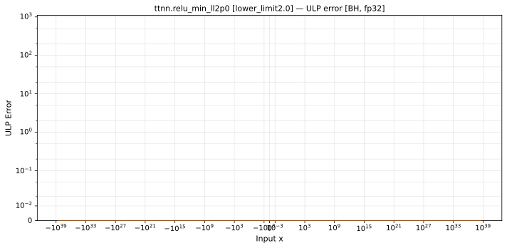

# relu_min — Blackhole (BH), float32
_This page is auto-generated by `scripts/generate_reports.py`. Do not edit manually._

_Generated: 2026-06-25 19:04 UTC_

**Architecture:** Blackhole (BH)  
**Data type:** float32  

---

[← Blackhole (BH) float32 ops](README.md) | [All archs for relu_min](../../../by_op/relu_min/README.md) | [Top](../../../README.md)

**Measured input range:** all normal values  

| Parameters | Max ULP | Mean ULP | Max abs error |
|------------|---------|----------|---------------|
| `lower_limit=0.5` | 0 | 0 | 0 |
| `lower_limit=1.0` | 0 | 0 | 0 |
| `lower_limit=2.0` | 0 | 0 | 0 |

### `lower_limit=0.5`

### `lower_limit=1.0`

### `lower_limit=2.0`

