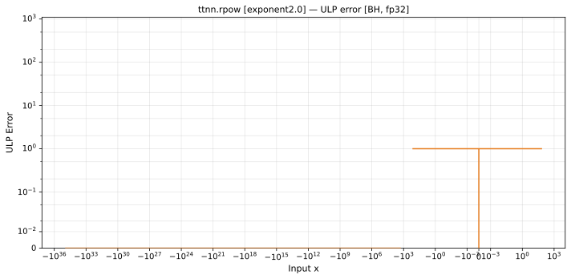

# rpow — Blackhole (BH), float32
_This page is auto-generated by `ttnn-accuracy report`. Do not edit manually._

_Generated: 2026-08-31 10:49_

**Architecture:** Blackhole (BH)  
**Data type:** float32  

---

[← Blackhole (BH) float32 ops](README.md) | [All archs for rpow](../../../by_op/rpow/README.md) | [Top](../../../README.md)

**Measured input range:** x ∈ [-3.403e+38, 128]  

| Parameters | Max ULP | Mean ULP | Accurate to \|x\| | Max abs error |
|---|---|---|---|---------------|
| `exponent=2.0` | 1 | 1 | 3.39e+38 | 2.03e+31 |

**exponent=2.0** — within 2 ULP everywhere · _squaring_  

**Outcomes**

| Parameters | exact | flushed | inexact | mismatch |
|------------|------|------|------|------|
| `exponent=2.0` | 41,980 | 395 | 5,624 | 1,537 |

### Special values

| Variant | x | device | golden | |
|---|---|---|---|---|
| `exponent=2.0` | 0 | 1 | 1 | agree |
| `exponent=2.0` | -0 | 1 | 1 | agree |
| `exponent=2.0` | inf | inf | inf | agree |
| `exponent=2.0` | -inf | inf | 0 | **differ** |
| `exponent=2.0` | nan | inf | nan | **differ** |
| `exponent=2.0` | 1.175e-38 | 1 | 1 | agree |
| `exponent=2.0` | -1.175e-38 | 1 | 1 | agree |

_Measured on BLACKHOLE · tt-metal `a5cd86212e1` · ttnn `0.75.0rc10.dev916+ga5cd86212e1` · run `20260831T103203`_

