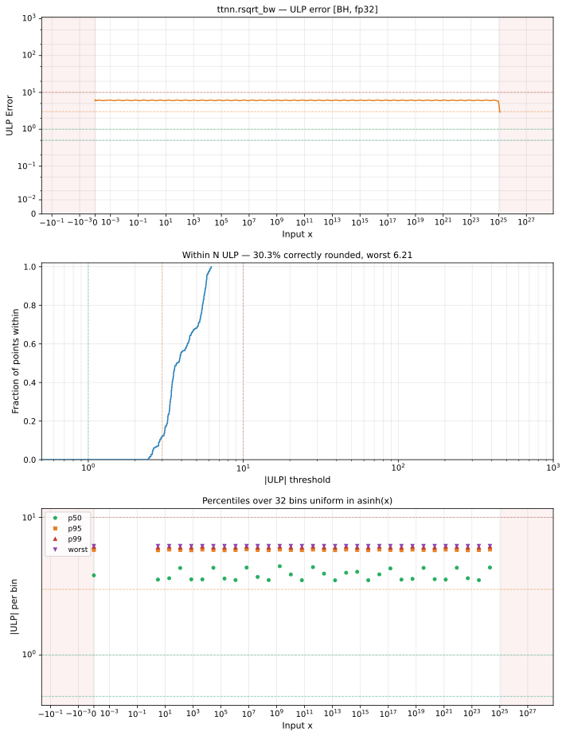

# rsqrt_bw — Blackhole (BH), float32
_This page is auto-generated by `ttnn-accuracy report`. Do not edit manually._

_Generated: 2026-09-01 07:57_

**Architecture:** Blackhole (BH)  
**Data type:** float32  

---

[← Blackhole (BH) float32 ops](README.md) | [All archs for rsqrt_bw](../../../by_op/rsqrt_bw/README.md) | [Top](../../../README.md)

**Measured input range:** x ∈ [1.295e-26, 1.217e+25]  

| Parameters | Max ULP | Mean ULP | Accurate to \|x\| | Max abs error |
|---|---|---|---|---------------|
| `default` | 7 | 4.5 | 2.04e-26 | 7.1e+31 |

**default** — accurate to |x| <= 2.04e-26; up to 7 ULP beyond  

**Outcomes**

| Parameters | inexact | mismatch |
|------------|------|------|
| `default` | 21,591 | 75 |

### Special values

| Variant | x | device | golden | |
|---|---|---|---|---|
| `default` | 0 | inf | -inf | **differ** |
| `default` | -0 | inf | inf | agree |
| `default` | inf | 0 | -0 | **differ** |
| `default` | -inf | nan | nan | agree |
| `default` | nan | -inf | nan | **differ** |
| `default` | 1.175e-38 | -inf | -inf | agree |
| `default` | -1.175e-38 | nan | nan | agree |

_Measured on BLACKHOLE · tt-metal `a5cd86212e1` · ttnn `0.75.0rc10.dev916+ga5cd86212e1` · run `20260831T103203`_

