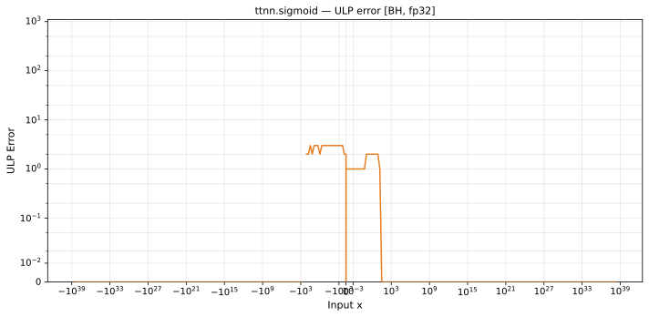

# sigmoid — Blackhole (BH), float32
_This page is auto-generated by `ttnn-accuracy report`. Do not edit manually._

**Architecture:** Blackhole (BH)  
**Data type:** float32  

---

[← Blackhole (BH) float32 ops](README.md) | [All archs for sigmoid](../../../by_op/sigmoid/README.md) | [Top](../../../README.md)

**Measured input range:** x ∈ [-3.403e+38, 3.403e+38]  

|  | `default` |
|---|---|
| Max ULP | 3.31 |
| Min ULP | 0 |
| Mean ULP | 1.59 |
| Signed bias (ULP) | -0.316 |
| p50 ULP | 0 |
| p95 ULP | 1.51 |
| p99 ULP | 2.54 |
| Exact fraction | 0.903 |
| Correctly rounded | 0.953 |
| Accurate to \|x\| | 1.59e-05 |
| Max abs error | 1.46e-07 |
| Max rel error | 2.05e-07 |
| Median rel error | 1.34e-07 |
| Bits of precision (worst) | 22.2 |
| Bits of precision (median) | 22.8 |

**default** — accurate to |x| <= 1.59e-05  

**Outcomes**

| Parameters | exact | faithful | flushed | inexact |
|---|---|---|---|---|
| `default` | 58,399 | 1,774 | 386 | 4,465 |

**Worst points**

| Parameters | x | golden | device | ULP |
|---|---|---|---|---|
| `default` | -16.642931 | 5.9165274e-08 | 5.9165263e-08 | 3.31 |
| `default` | -1.1100198 | 0.2478672 | 0.24786724 | 3.01 |
| `default` | -0.012242236 | 0.49693948 | 0.4969394 | 2.96 |
| `default` | -0.017021108 | 0.49574482 | 0.4957449 | 2.96 |
| `default` | -0.020005303 | 0.49499884 | 0.49499875 | 2.96 |
| `default` | -1.1191208 | 0.2461744 | 0.24617444 | 2.95 |
| `default` | -0.0121267075 | 0.49696836 | 0.49696845 | 2.95 |
| `default` | -0.01693731 | 0.49576578 | 0.4957657 | 2.94 |
| `default` | -0.012270969 | 0.4969323 | 0.4969322 | 2.94 |
| `default` | -0.017104082 | 0.49572408 | 0.49572417 | 2.94 |

**Monotonicity**

_Checked only where the reference is itself ordered, and never across a discontinuity._

| Parameters | Pairs | Violations | Rate | Worst \|Δy\| |
|---|---|---|---|---|
| `default` | 64,635 | 0 | 0 | 0 |

### Special values

| Variant | x | device | golden |  |
|---|---|---|---|---|
| `default` | 0 | 0.5 | 0.5 | agree |
| `default` | -0 | 0.5 | 0.5 | agree |
| `default` | inf | 1 | 1 | agree |
| `default` | -inf | 0 | 0 | agree |
| `default` | nan | 0 | nan | **differ** |
| `default` | 1.1754944e-38 | 0.5 | 0.5 | agree |
| `default` | -1.1754944e-38 | 0.5 | 0.5 | agree |

_Measured on BLACKHOLE · tt-metal `de546d3b146` · ttnn `0.79.0` · run `20261003T030327`_

