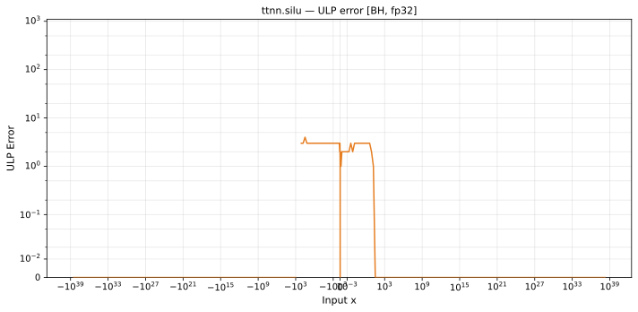

# silu — Blackhole (BH), float32
_This page is auto-generated by `ttnn-accuracy report`. Do not edit manually._

**Architecture:** Blackhole (BH)  
**Data type:** float32  

---

[← Blackhole (BH) float32 ops](README.md) | [All archs for silu](../../../by_op/silu/README.md) | [Top](../../../README.md)

**Measured input range:** x ∈ [-3.403e+38, 3.403e+38]  

|  | `default` |
|---|---|
| Max ULP | 3.61 |
| Min ULP | 0 |
| Mean ULP | 1.78 |
| Signed bias (ULP) | 0.284 |
| p50 ULP | 0 |
| p95 ULP | 1.87 |
| p99 ULP | 2.69 |
| Exact fraction | 0.897 |
| Correctly rounded | 0.944 |
| Accurate to \|x\| | 2.01e-05 |
| Max abs error | 1.85e-06 |
| Max rel error | 2.33e-07 |
| Median rel error | 1.6e-07 |
| Bits of precision (worst) | 22 |
| Bits of precision (median) | 22.6 |

**default** — 9 of 65024 points returned inf or zero where a value exists  

**Outcomes**

| Parameters | exact | faithful | flushed | inexact | zeroed |
|---|---|---|---|---|---|
| `default` | 57,751 | 1,078 | 631 | 5,555 | 9 |

**Worst points**

| Parameters | x | golden | device | ULP |
|---|---|---|---|---|
| `default` | -16.71469 | -9.204516e-07 | -9.2045184e-07 | 3.61 |
| `default` | -16.765865 | -8.772092e-07 | -8.7720935e-07 | 3.36 |
| `default` | -0.03066779 | -0.015098785 | -0.015098788 | 3.33 |
| `default` | -0.13386574 | -0.06245954 | -0.06245953 | 3.31 |
| `default` | -0.06359583 | -0.03078715 | -0.030787155 | 3.29 |
| `default` | -0.03080709 | -0.015166295 | -0.015166292 | 3.27 |
| `default` | -0.06422386 | -0.03108111 | -0.031081116 | 3.27 |
| `default` | -17.448456 | -4.613058e-07 | -4.613059e-07 | 3.27 |
| `default` | -1.970778 | -0.24103668 | -0.24103664 | 3.26 |
| `default` | -1.9622402 | -0.24179667 | -0.24179663 | 3.25 |

**Monotonicity**

_Checked only where the reference is itself ordered, and never across a discontinuity._

| Parameters | Pairs | Violations | Rate | Worst \|Δy\| |
|---|---|---|---|---|
| `default` | 32,384 | 0 | 0 | 0 |

### Special values

| Variant | x | device | golden |  |
|---|---|---|---|---|
| `default` | 0 | 0 | 0 | agree |
| `default` | -0 | 0 | -0 | **differ** |
| `default` | inf | inf | inf | agree |
| `default` | -inf | nan | nan | agree |
| `default` | nan | nan | nan | agree |
| `default` | 1.1754944e-38 | 0 | 5.877472e-39 | **differ** |
| `default` | -1.1754944e-38 | -0 | -5.877472e-39 | **differ** |

> **Provenance unknown.** These figures predate run tracking. Re-measure to attribute them.

