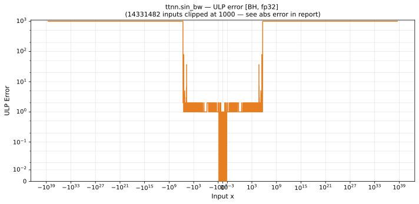

# sin_bw — Blackhole (BH), float32
_This page is auto-generated by `ttnn-accuracy report`. Do not edit manually._

**Architecture:** Blackhole (BH)  
**Data type:** float32  

---

[← Blackhole (BH) float32 ops](README.md) | [All archs for sin_bw](../../../by_op/sin_bw/README.md) | [Top](../../../README.md)

**Measured input range:** x ∈ [-3.403e+38, 3.403e+38]  

|  | `default` |
|---|---|
| Max ULP | 1.56e+53 ⚠ |
| Min ULP | 0 |
| Mean ULP | 2.03e+49 |
| Signed bias (ULP) | 6.91e+44 |
| p50 ULP | 0 |
| p95 ULP | 1.18e+47 |
| p99 ULP | 1.09e+49 |
| Exact fraction | 0.609 |
| Correctly rounded | 0.802 |
| Accurate to \|x\| | 92.4 |
| Max abs error | 3.4e+38 |
| Max rel error | 1e+46 |
| Median rel error | 2.85e+03 |
| Bits of precision (worst) | -153 |
| Bits of precision (median) | -11.5 |

**default** — 18190 of 65024 points returned inf or zero where a value exists  

**Outcomes**

| Parameters | exact | faithful | inexact | mismatch |
|---|---|---|---|---|
| `default` | 28,542 | 1,836 | 16,456 | 18,190 |

**Worst points**

| Parameters | x | golden | device | ULP |
|---|---|---|---|---|
| `default` | 1.522789e+12 | -6.91636e-09 | -6.925906e+37 | 1.56e+53 |
| `default` | -1.522789e+12 | -6.91636e-09 | 6.925906e+37 | 1.56e+53 |
| `default` | 5.891519e+11 | -2.0013037e-07 | 7.959781e+37 | 5.6e+51 |
| `default` | -5.891519e+11 | -2.0013037e-07 | -7.959781e+37 | 5.6e+51 |
| `default` | 1.0784855e+12 | -1.4147454e-06 | 3.2046572e+38 | 2.82e+51 |
| `default` | -1.0784855e+12 | -1.4147454e-06 | -3.2046572e+38 | 2.82e+51 |
| `default` | 2.0121226e+12 | 1.2076987e-06 | 2.8443145e+38 | 2.5e+51 |
| `default` | -2.0121226e+12 | 1.2076987e-06 | -2.8443145e+38 | 2.5e+51 |
| `default` | 2.9007295e+12 | -1.6356248e-06 | 2.6819475e+38 | 2.36e+51 |
| `default` | -2.9007295e+12 | -1.6356248e-06 | -2.6819475e+38 | 2.36e+51 |

**Non-finite outputs**

| Parameters | Points | Both | Device only | Golden only | Device inf | Device nan | Golden inf | Golden nan |
|---|---|---|---|---|---|---|---|---|
| `default` | 18,190 | 0 | 18,190 | 0 | 18,190 | 0 | 0 | 0 |

| Parameters | x | golden | device |
|---|---|---|---|
| `default` | 3.0399297e+16 | 0.1119759 | inf |
| `default` | 3.1525197e+16 | -0.3960688 | -inf |
| `default` | 3.2088147e+16 | -0.61859477 | inf |
| `default` | 3.2791835e+16 | 0.8369054 | inf |
| `default` | 3.5043635e+16 | 0.8961883 | inf |
| `default` | 3.968797e+16 | 0.8581212 | inf |
| `default` | 4.025092e+16 | 0.9612002 | inf |
| `default` | 4.2784196e+16 | 0.62997866 | -inf |
| `default` | 5.0665496e+16 | -0.18593045 | inf |
| `default` | 5.1228446e+16 | 0.07263864 | inf |

### Special values

| Variant | x | device | golden |  |
|---|---|---|---|---|
| `default` | 0 | 1 | 1 | agree |
| `default` | -0 | 1 | 1 | agree |
| `default` | inf | nan | nan | agree |
| `default` | -inf | nan | nan | agree |
| `default` | nan | nan | nan | agree |
| `default` | 1.1754944e-38 | 1 | 1 | agree |
| `default` | -1.1754944e-38 | 1 | 1 | agree |

> **Provenance unknown.** These figures predate run tracking. Re-measure to attribute them.

