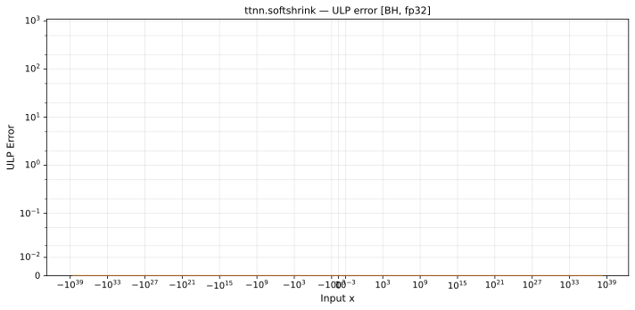

# softshrink — Blackhole (BH), float32
_This page is auto-generated by `ttnn-accuracy report`. Do not edit manually._

**Architecture:** Blackhole (BH)  
**Data type:** float32  

---

[← Blackhole (BH) float32 ops](README.md) | [All archs for softshrink](../../../by_op/softshrink/README.md) | [Top](../../../README.md)

**Measured input range:** x ∈ [-3.403e+38, 3.403e+38]  

|  | `default` |
|---|---|
| Max ULP | 0.5 |
| Min ULP | 0 |
| Mean ULP | 0 |
| Signed bias (ULP) | 0 |
| p50 ULP | 0 |
| p95 ULP | 0.000122 |
| p99 ULP | 0.125 |
| Exact fraction | 1 |
| Correctly rounded | 1 |
| Accurate to \|x\| | 3.39e+38 |
| Max abs error | 0.5 |
| Max rel error | 5.96e-08 |
| Median rel error | 0 |
| Bits of precision (worst) | 24 |
| Bits of precision (median) | — |

**default** — bit-exact  

**Outcomes**

| Parameters | exact |
|---|---|
| `default` | 65,024 |

**Worst points**

| Parameters | x | golden | device | ULP |
|---|---|---|---|---|
| `default` | 8388609 | 8388608 | 8388608 | 0.5 |
| `default` | 8454144 | 8454144 | 8454144 | 0.5 |
| `default` | 8519680 | 8519680 | 8519680 | 0.5 |
| `default` | 8585216 | 8585216 | 8585216 | 0.5 |
| `default` | 8650752 | 8650752 | 8650752 | 0.5 |
| `default` | 8716288 | 8716288 | 8716288 | 0.5 |
| `default` | 8781824 | 8781824 | 8781824 | 0.5 |
| `default` | 8847360 | 8847360 | 8847360 | 0.5 |
| `default` | 8912896 | 8912896 | 8912896 | 0.5 |
| `default` | 8978432 | 8978432 | 8978432 | 0.5 |

**Monotonicity**

_Checked only where the reference is itself ordered, and never across a discontinuity._

| Parameters | Pairs | Violations | Rate | Worst \|Δy\| |
|---|---|---|---|---|
| `default` | 65,022 | 0 | 0 | 0 |

### Special values

| Variant | x | device | golden |  |
|---|---|---|---|---|
| `default` | 0 | 0 | 0 | agree |
| `default` | -0 | 0 | 0 | agree |
| `default` | inf | inf | inf | agree |
| `default` | -inf | -inf | -inf | agree |
| `default` | nan | nan | nan | agree |
| `default` | 1.1754944e-38 | 0 | 0 | agree |
| `default` | -1.1754944e-38 | 0 | 0 | agree |

_Measured on BLACKHOLE · tt-metal `de546d3b146` · ttnn `0.79.0` · run `20261010T030214`_

