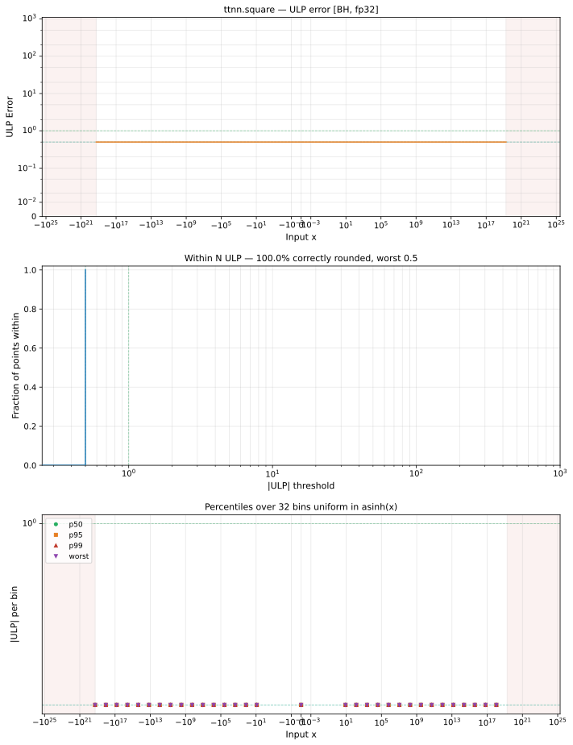

# square — Blackhole (BH), float32
_This page is auto-generated by `ttnn-accuracy report`. Do not edit manually._

_Generated: 2026-09-01 07:57_

**Architecture:** Blackhole (BH)  
**Data type:** float32  

---

[← Blackhole (BH) float32 ops](README.md) | [All archs for square](../../../by_op/square/README.md) | [Top](../../../README.md)

**Measured input range:** x ∈ [-1.845e+19, 1.845e+19]  

| Parameters | Max ULP | Mean ULP | Accurate to \|x\| | Max abs error |
|---|---|---|---|---------------|
| `default` | 0 | — | 1.84e+19 | 0 |

**default** — bit-exact  

**Outcomes**

| Parameters | exact | flushed |
|------------|------|------|
| `default` | 32,512 | 16,128 |

### Special values

| Variant | x | device | golden | |
|---|---|---|---|---|
| `default` | 0 | 0 | 0 | agree |
| `default` | -0 | 0 | 0 | agree |
| `default` | inf | inf | inf | agree |
| `default` | -inf | inf | inf | agree |
| `default` | nan | nan | nan | agree |
| `default` | 1.175e-38 | 0 | 0 | agree |
| `default` | -1.175e-38 | 0 | 0 | agree |

_Measured on BLACKHOLE · tt-metal `a5cd86212e1` · ttnn `0.75.0rc10.dev916+ga5cd86212e1` · run `20260831T103203`_

