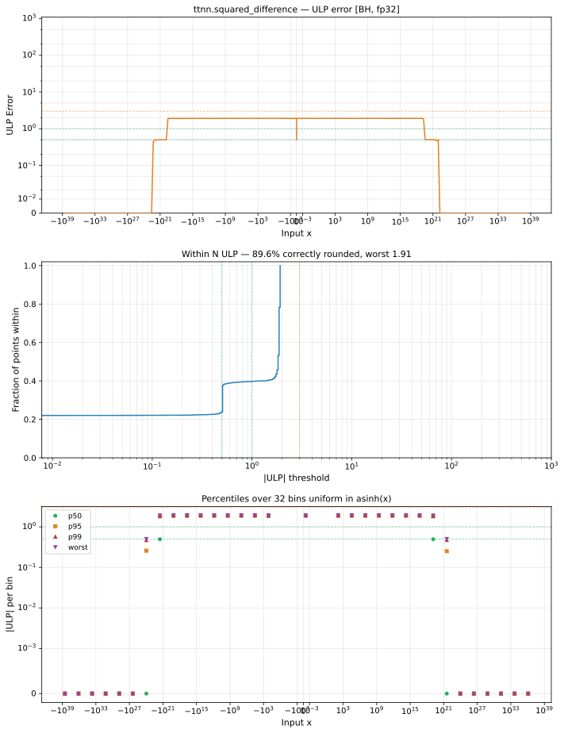

# squared_difference — Blackhole (BH), float32
_This page is auto-generated by `ttnn-accuracy report`. Do not edit manually._

**Architecture:** Blackhole (BH)  
**Data type:** float32  

---

[← Blackhole (BH) float32 ops](README.md) | [All archs for squared_difference](../../../by_op/squared_difference/README.md) | [Top](../../../README.md)

**Measured input range:** all normal values  

|  | `default` |
|---|---|
| Max ULP | 1.91 |
| Min ULP | 0 |
| Mean ULP | 1.78 |
| Signed bias (ULP) | -0.0272 |
| p50 ULP | 1.81 |
| p95 ULP | 1.89 |
| p99 ULP | 1.91 |
| Exact fraction | 0.367 |
| Correctly rounded | 0.896 |
| Max abs error | 3.01e+31 |
| Max rel error | 1.54e-07 |
| Median rel error | 1.14e-07 |
| Bits of precision (worst) | 22.6 |
| Bits of precision (median) | 23.1 |

**default** — within 2 ULP everywhere  

**Outcomes**

| Parameters | exact | faithful | inexact |
|---|---|---|---|
| `default` | 23,863 | 1,997 | 39,164 |

**Worst points**

| Parameters | x | x2 | golden | device | ULP |
|---|---|---|---|---|---|
| `default` | 4.2883432e+10 | -5.703514e+09 | 2.3606914e+21 | 2.3606916e+21 | 1.91 |
| `default` | -5.703514e+09 | 4.2883432e+10 | 2.3606914e+21 | 2.3606916e+21 | 1.91 |
| `default` | 7.6943126e-19 | 1.9959316e-18 | 1.5043031e-36 | 1.5043033e-36 | 1.91 |
| `default` | 1.9959316e-18 | 7.6943126e-19 | 1.5043031e-36 | 1.5043033e-36 | 1.91 |
| `default` | -0.083141245 | -0.25989857 | 0.031243153 | 0.031243157 | 1.91 |
| `default` | -0.25989857 | -0.083141245 | 0.031243153 | 0.031243157 | 1.91 |
| `default` | -5.820417e-07 | -3.277755e-06 | 7.2668703e-12 | 7.2668694e-12 | 1.91 |
| `default` | -3.277755e-06 | -5.820417e-07 | 7.2668703e-12 | 7.2668694e-12 | 1.91 |
| `default` | 2.2408478e-06 | -4.5500326e-07 | 7.267613e-12 | 7.2676123e-12 | 1.91 |
| `default` | -4.5500326e-07 | 2.2408478e-06 | 7.267613e-12 | 7.2676123e-12 | 1.91 |

### Special values

| Variant | x | device | golden |  |
|---|---|---|---|---|
| `default` | 0 | 1 | 1 | agree |
| `default` | -0 | 1 | 1 | agree |
| `default` | inf | inf | inf | agree |
| `default` | -inf | inf | inf | agree |
| `default` | nan | nan | nan | agree |
| `default` | 1.1754944e-38 | 1 | 1 | agree |
| `default` | -1.1754944e-38 | 1 | 1 | agree |

> **Sampled, not exhaustive.** For this op both operands take 65,536 of the 2³² fp32 values, drawn once from a fixed seed. The figures above are a lower bound on the error, and comparable between releases, but they are not a bound over the dtype.

_Measured on BLACKHOLE · tt-metal `a3a9fb4229a` · ttnn `0.78.0` · run `20260918T102923`_

