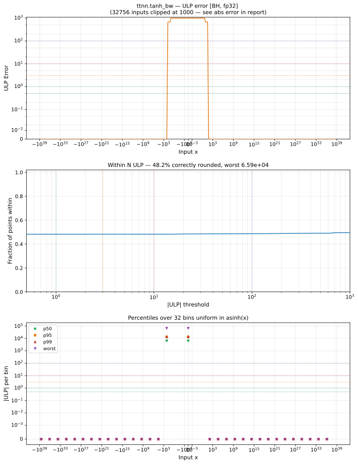

# tanh_bw — Blackhole (BH), float32
_This page is auto-generated by `ttnn-accuracy report`. Do not edit manually._

_Generated: 2026-09-03 10:37_

**Architecture:** Blackhole (BH)  
**Data type:** float32  

---

[← Blackhole (BH) float32 ops](README.md) | [All archs for tanh_bw](../../../by_op/tanh_bw/README.md) | [Top](../../../README.md)

**Measured input range:** x ∈ [-3.403e+38, 3.403e+38]  

| Parameters | Max ULP | Mean ULP | Accurate to \|x\| | Max abs error |
|---|---|---|---|---------------|
| `default` | 4.19e+06 ⚠ | 9.01e+03 | nowhere | 0.000814 |

**default** — never within 2 ULP; mean 9.01e+03, worst 4.19e+06  

**Outcomes**

| Parameters | exact | inexact |
|------------|------|------|
| `default` | 31,390 | 33,634 |

### Special values

| Variant | x | device | golden | |
|---|---|---|---|---|
| `default` | 0 | 0.9992 | 1 | **differ** |
| `default` | -0 | 0.9992 | 1 | **differ** |
| `default` | inf | 0 | 0 | agree |
| `default` | -inf | 0 | 0 | agree |
| `default` | nan | 0 | nan | **differ** |
| `default` | 1.175e-38 | 0.9992 | 1 | **differ** |
| `default` | -1.175e-38 | 0.9992 | 1 | **differ** |

_Measured on BLACKHOLE · tt-metal `72023534b03` · ttnn `0.75.0rc10.dev916+ga5cd86212e1` · run `20260903T103548`_

