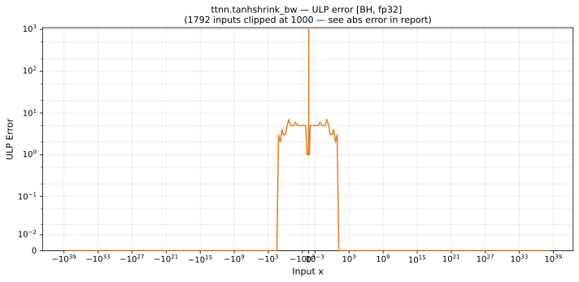

# tanhshrink_bw — Blackhole (BH), float32
_This page is auto-generated by `ttnn-accuracy report`. Do not edit manually._

**Architecture:** Blackhole (BH)  
**Data type:** float32  

---

[← Blackhole (BH) float32 ops](README.md) | [All archs for tanhshrink_bw](../../../by_op/tanhshrink_bw/README.md) | [Top](../../../README.md)

**Measured input range:** x ∈ [-3.403e+38, 3.403e+38]  

|  | `default` |
|---|---|
| Max ULP | 4.19e+06 ⚠ |
| Min ULP | 0 |
| Mean ULP | 1.02e+05 |
| Signed bias (ULP) | 1.19e+04 |
| p50 ULP | 0 |
| p95 ULP | 5.03 |
| p99 ULP | 2.6e+05 |
| Exact fraction | 0.865 |
| Correctly rounded | 0.901 |
| Accurate to \|x\| | 7.42e-09 |
| Max abs error | 2.18e-07 |
| Max rel error | 0.5 |
| Median rel error | 3.16e-07 |
| Bits of precision (worst) | 1 |
| Bits of precision (median) | 21.6 |

**default** — accurate to |x| <= 7.42e-09; up to 4.19e+06 ULP beyond  

**Outcomes**

| Parameters | exact | faithful | inexact |
|---|---|---|---|
| `default` | 48,298 | 428 | 16,298 |

**Worst points**

| Parameters | x | golden | device | ULP |
|---|---|---|---|---|
| `default` | 1.2904784e-08 | 1.110223e-16 | 1.6653345e-16 | 4.19e+06 |
| `default` | -1.2904784e-08 | 1.110223e-16 | 1.6653345e-16 | 4.19e+06 |
| `default` | 7.4505815e-09 | 1.110223e-16 | 5.5511164e-17 | 4.19e+06 |
| `default` | -7.4505815e-09 | 1.110223e-16 | 5.5511164e-17 | 4.19e+06 |
| `default` | 7.508788e-09 | 1.110223e-16 | 5.63819e-17 | 4.13e+06 |
| `default` | -7.508788e-09 | 1.110223e-16 | 5.63819e-17 | 4.13e+06 |
| `default` | 1.2863892e-08 | 1.110223e-16 | 1.6547972e-16 | 4.11e+06 |
| `default` | -1.2863892e-08 | 1.110223e-16 | 1.6547972e-16 | 4.11e+06 |
| `default` | 7.566996e-09 | 1.110223e-16 | 5.725943e-17 | 4.06e+06 |
| `default` | -7.566996e-09 | 1.110223e-16 | 5.725943e-17 | 4.06e+06 |

**Monotonicity**

_Checked only where the reference is itself ordered, and never across a discontinuity._

| Parameters | Pairs | Violations | Rate | Worst \|Δy\| |
|---|---|---|---|---|
| `default` | 65,022 | 26 | 0.0004 | 1.5e-07 |

_Worst violations — the device output moved against the reference's own direction between these neighbouring inputs._

| Parameters | x | device | \|Δy\| |
|---|---|---|---|
| `default` | -7.6012816 → -7.5876226 | 0.9999989 → 0.99999905 | 1.5e-07 |
| `default` | 7.5876226 → 7.6012816 | 0.99999905 → 0.9999989 | 1.5e-07 |
| `default` | -8.687499 → -8.5625 | 0.99999976 → 0.9999999 | 1.4e-07 |
| `default` | -8.499977 → -8.396581 | 0.99999976 → 0.9999999 | 1.4e-07 |
| `default` | 8.396581 → 8.499977 | 0.9999999 → 0.99999976 | 1.4e-07 |

### Special values

| Variant | x | device | golden |  |
|---|---|---|---|---|
| `default` | 0 | 0 | 0 | agree |
| `default` | -0 | 0 | 0 | agree |
| `default` | inf | 1 | 1 | agree |
| `default` | -inf | 1 | 1 | agree |
| `default` | nan | nan | nan | agree |
| `default` | 1.1754944e-38 | 0 | 0 | agree |
| `default` | -1.1754944e-38 | 0 | 0 | agree |

_Measured on BLACKHOLE · tt-metal `a3a9fb4229a` · ttnn `0.78.0` · run `20260918T102923`_

