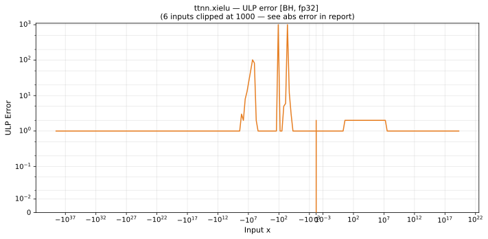

# xielu — Blackhole (BH), float32
_This page is auto-generated by `ttnn-accuracy report`. Do not edit manually._

_Generated: 2026-09-01 13:48_

**Architecture:** Blackhole (BH)  
**Data type:** float32  

---

[← Blackhole (BH) float32 ops](README.md) | [All archs for xielu](../../../by_op/xielu/README.md) | [Top](../../../README.md)

**Measured input range:** x ∈ [-3.403e+38, 2.061e+19]  

| Parameters | Max ULP | Mean ULP | Accurate to \|x\| | Max abs error |
|---|---|---|---|---------------|
| `default` | 1.08e+07 ⚠ | 256 | 0.691 | 2.03e+31 |

**default** — accurate to |x| <= 0.691; up to 1.08e+07 ULP beyond  

**Outcomes**

| Parameters | exact | flushed | inexact |
|------------|------|------|------|
| `default` | 14,457 | 127 | 42,264 |

### Special values

| Variant | x | device | golden | |
|---|---|---|---|---|
| `default` | 0 | -8e-07 | -8e-07 | agree |
| `default` | -0 | -8e-07 | -8e-07 | agree |
| `default` | inf | inf | inf | agree |
| `default` | -inf | nan | nan | agree |
| `default` | nan | nan | nan | agree |
| `default` | 1.175e-38 | 0 | 5.877e-39 | **differ** |
| `default` | -1.175e-38 | -8e-07 | -8e-07 | agree |

_Measured on BLACKHOLE · tt-metal `f9377427c7f` · ttnn `0.75.0rc10.dev916+ga5cd86212e1` · run `20260901T134349`_

