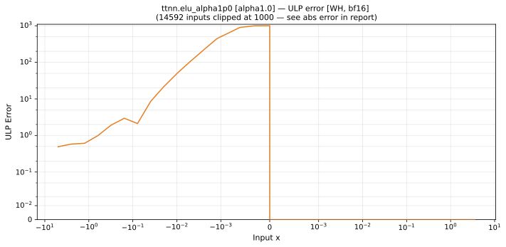
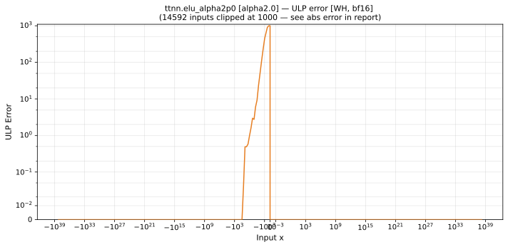

# Wormhole (WH) — bfloat16
_This page is auto-generated by `scripts/generate_reports.py`. Do not edit manually._

_Generated: 2026-04-28 09:42 UTC_

[← Wormhole (WH)](../README.md) | [Top](../../../README.md)

## Operations Summary

| Op | Variant | Max ULP | Mean ULP | Details |
|----|---------|---------|----------|---------|
| `abs` | default | 0 | 0 | [abs.md](abs.md) |
| `acos` | default | 0.5 | 0.0774 | [acos.md](acos.md) |
| `asin` | default | 1.18 | 0.00949 | [asin.md](asin.md) |
| `atan` | default | 1.18 | 0.0216 | [atan.md](atan.md) |
| `cbrt` | default | 0.507 | 0.248 | [cbrt.md](cbrt.md) |
| `ceil` | default | 0 | 0 | [ceil.md](ceil.md) |
| `celu` | alpha0.5 | 8.62e+34 | 2.91e+33 | [celu_alpha0p5.md](celu_alpha0p5.md) |
| `celu` | alpha1.0 | 1.72e+35 | 5.83e+33 | [celu_alpha1p0.md](celu_alpha1p0.md) |
| `celu` | alpha2.0 | 3.45e+35 | 1.17e+34 | [celu_alpha2p0.md](celu_alpha2p0.md) |
| `cos` | default | 0.5 | 0.0217 | [cos.md](cos.md) |
| `cosh` | default | 1.4 | 0.04 | [cosh.md](cosh.md) |
| `digamma` | default | 4.94 | 0.685 | [digamma.md](digamma.md) |
| `elu` | alpha0.5 | 8.62e+34 | 3.25e+33 | [elu_alpha0p5.md](elu_alpha0p5.md) |
| `elu` | alpha1.0 | 1.72e+35 | 5.83e+33 | [elu_alpha1p0.md](elu_alpha1p0.md) |
| `elu` | alpha2.0 | 3.45e+35 | 1.03e+34 | [elu_alpha2p0.md](elu_alpha2p0.md) |
| `erf` | default | 1.06 | 0.51 | [erf.md](erf.md) |
| `erfinv` | default | 255 | 166 | [erfinv.md](erfinv.md) |
| `exp` | default | 0.894 | 0.0388 | [exp.md](exp.md) |
|  | fast_approx | 6.08 | 3.03 |  |
| `exp2` | default | 0.898 | 0.0374 | [exp2.md](exp2.md) |
| `expm1` | default | 1.21 | 0.0324 | [expm1.md](expm1.md) |
| `floor` | default | 0 | 0 | [floor.md](floor.md) |
| `gelu` | default | 1.02 | 0.0261 | [gelu.md](gelu.md) |
|  | fast_approx | 1.04e+34 | 8.27e+32 |  |
| `hardmish` | default | 255 | 177 | [hardmish.md](hardmish.md) |
| `hardtanh` | min-1_max1 | 0 | 0 | [hardtanh.md](hardtanh.md) |
|  | min-2_max2 | 0 | 0 |  |
| `identity` | default | 0 | 0 | [identity.md](identity.md) |
| `lgamma` | default | 164 | 0.654 | [lgamma.md](lgamma.md) |
| `log` | default | 0.751 | 0.25 | [log.md](log.md) |
| `log10` | default | 1.79 | 0.249 | [log10.md](log10.md) |
| `log1p` | default | 0.931 | 0.0273 | [log1p.md](log1p.md) |
| `log2` | default | 1.03 | 0.248 | [log2.md](log2.md) |
| `log_sigmoid` | default | 6.39 | 0.483 | [log_sigmoid.md](log_sigmoid.md) |
| `logit` | default | 64.3 | 0.387 | [logit.md](logit.md) |
| `mish` | default | 2.16 | 0.634 | [mish.md](mish.md) |
| `reciprocal` | default | 0.512 | 0.238 | [reciprocal.md](reciprocal.md) |
| `relu` | default | 0 | 0 | [relu.md](relu.md) |
| `relu_max` | upper_limit0.5 | 0 | 0 | [relu_max_ul0p5.md](relu_max_ul0p5.md) |
| `relu_max` | upper_limit1.0 | 0 | 0 | [relu_max_ul1p0.md](relu_max_ul1p0.md) |
| `relu_max` | upper_limit2.0 | 0 | 0 | [relu_max_ul2p0.md](relu_max_ul2p0.md) |
| `relu_min` | lower_limit0.5 | 0 | 0 | [relu_min_ll0p5.md](relu_min_ll0p5.md) |
| `relu_min` | lower_limit1.0 | 0 | 0 | [relu_min_ll1p0.md](relu_min_ll1p0.md) |
| `relu_min` | lower_limit2.0 | 0 | 0 | [relu_min_ll2p0.md](relu_min_ll2p0.md) |
| `round` | default | 0 | 0 | [round.md](round.md) |
| `rsqrt` | default | 0.499 | 0.247 | [rsqrt.md](rsqrt.md) |
| `selu` | default | 3.04e+35 | 9.26e+33 | [selu.md](selu.md) |
| `sigmoid` | default | 0.788 | 0.0265 | [sigmoid.md](sigmoid.md) |
| `silu` | default | 1.18 | 0.0285 | [silu.md](silu.md) |
| `sin` | default | 0.5 | 0.0217 | [sin.md](sin.md) |
| `sinh` | default | 1.8e+03 | 172 | [sinh.md](sinh.md) |
| `softplus` | beta0.5 | 0.51 | 0.428 | [softplus_beta0p5.md](softplus_beta0p5.md) |
| `softplus` | beta1.0 | 0.51 | 0.426 | [softplus_beta1p0.md](softplus_beta1p0.md) |
| `softplus` | beta2.0 | 1.24 | 0.424 | [softplus_beta2p0.md](softplus_beta2p0.md) |
| `softsign` | default | 1 | 0.157 | [softsign.md](softsign.md) |
| `sqrt` | default | 0.5 | 0.248 | [sqrt.md](sqrt.md) |
| `tan` | default | 0.501 | 0.0105 | [tan.md](tan.md) |
| `tanh` | default | 1.18 | 0.0143 | [tanh.md](tanh.md) |
| `tanhshrink` | default | 254 | 31.7 | [tanhshrink.md](tanhshrink.md) |

---

## Charts Preview

### [abs](abs.md)

### [acos](acos.md)

### [asin](asin.md)

### [atan](atan.md)

### [cbrt](cbrt.md)

### [ceil](ceil.md)

### [celu](celu_alpha0p5.md)

### [celu](celu_alpha1p0.md)

### [celu](celu_alpha2p0.md)

### [cos](cos.md)

### [cosh](cosh.md)

### [digamma](digamma.md)

### [elu](elu_alpha0p5.md)

### [elu](elu_alpha1p0.md)

### [elu](elu_alpha2p0.md)

### [erf](erf.md)

### [erfinv](erfinv.md)

### [exp](exp.md)

### [exp2](exp2.md)

### [expm1](expm1.md)

### [floor](floor.md)

### [gelu](gelu.md)

### [hardmish](hardmish.md)

### [hardtanh](hardtanh.md)

### [identity](identity.md)

### [lgamma](lgamma.md)

### [log](log.md)

### [log10](log10.md)

### [log1p](log1p.md)

### [log2](log2.md)

### [log_sigmoid](log_sigmoid.md)

### [logit](logit.md)

### [mish](mish.md)

### [reciprocal](reciprocal.md)

### [relu](relu.md)

### [relu_max](relu_max_ul0p5.md)

### [relu_max](relu_max_ul1p0.md)

### [relu_max](relu_max_ul2p0.md)

### [relu_min](relu_min_ll0p5.md)

### [relu_min](relu_min_ll1p0.md)

### [relu_min](relu_min_ll2p0.md)

### [round](round.md)

### [rsqrt](rsqrt.md)

### [selu](selu.md)

### [sigmoid](sigmoid.md)

### [silu](silu.md)

### [sin](sin.md)

### [sinh](sinh.md)

### [softplus](softplus_beta0p5.md)

### [softplus](softplus_beta1p0.md)

### [softplus](softplus_beta2p0.md)

### [softsign](softsign.md)

### [sqrt](sqrt.md)

### [tan](tan.md)

### [tanh](tanh.md)

### [tanhshrink](tanhshrink.md)

