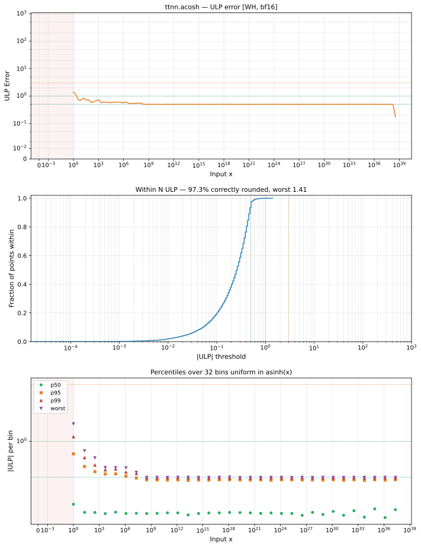

# acosh — Wormhole (WH), bfloat16
_This page is auto-generated by `ttnn-accuracy report`. Do not edit manually._

**Architecture:** Wormhole (WH)  
**Data type:** bfloat16  

---

[← Wormhole (WH) bfloat16 ops](README.md) | [All archs for acosh](../../../by_op/acosh/README.md) | [Top](../../../README.md)

**Measured input range:** x ∈ [1, 3.39e+38]  

| Parameters | Max ULP | Mean ULP | Accurate to \|x\| | Max abs error |
|---|---|---|---|---------------|
| `default` | 1 | 0.994 | 3.39e+38 | 0.25 |

**default** — within 2 ULP everywhere  

**Outcomes**

| Parameters | exact | inexact |
|------------|------|------|
| `default` | 15,939 | 445 |

### Special values

| Variant | x | device | golden | |
|---|---|---|---|---|
| `default` | 0 | inf | nan | **differ** |
| `default` | -0 | inf | nan | **differ** |
| `default` | inf | inf | inf | agree |
| `default` | -inf | inf | nan | **differ** |
| `default` | nan | inf | nan | **differ** |
| `default` | 1.175e-38 | inf | nan | **differ** |
| `default` | -1.175e-38 | inf | nan | **differ** |

_Measured on WORMHOLE_B0 · tt-metal `9f9cd4fd590` · ttnn `0.77.0` · run `20260915T152226`_

