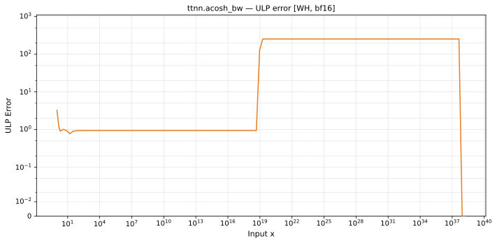

# acosh_bw — Wormhole (WH), bfloat16
_This page is auto-generated by `ttnn-accuracy report`. Do not edit manually._

**Architecture:** Wormhole (WH)  
**Data type:** bfloat16  

---

[← Wormhole (WH) bfloat16 ops](README.md) | [All archs for acosh_bw](../../../by_op/acosh_bw/README.md) | [Top](../../../README.md)

**Measured input range:** x ∈ [-8.507e+37, 8.507e+37]  

|  | `default` |
|---|---|
| Max ULP | 3.26 |
| Min ULP | 0 |
| Mean ULP | 0.688 |
| Signed bias (ULP) | -0.682 |
| p50 ULP | 0.274 |
| p95 ULP | 0.784 |
| p99 ULP | 0.94 |
| Exact fraction | 0.781 |
| Correctly rounded | 0.781 |
| Accurate to \|x\| | 1.03 |
| Max abs error | 0.0509 |
| Max rel error | 0.0199 |
| Median rel error | 0.00372 |
| Bits of precision (worst) | 5.65 |
| Bits of precision (median) | 8.07 |

**default** — 15874 of 64514 points returned inf or zero where a value exists; the rest reach 3.26 ULP  

**Outcomes**

| Parameters | exact | faithful | inexact | mismatch | zeroed |
|---|---|---|---|---|---|
| `default` | 12,788 | 3,546 | 48 | 32,258 | 15,874 |

**Worst points**

| Parameters | x | golden | device | ULP |
|---|---|---|---|---|
| `default` | 1.0703125 | 2.625 | 2.671875 | 3.26 |
| `default` | -1.0703125 | 2.625 | 2.671875 | 3.26 |
| `default` | 1.078125 | 2.484375 | 2.53125 | 3.16 |
| `default` | -1.078125 | 2.484375 | 2.53125 | 3.16 |
| `default` | 1.0546875 | 2.984375 | 3.03125 | 3.07 |
| `default` | -1.0546875 | 2.984375 | 3.03125 | 3.07 |
| `default` | 1.0859375 | 2.359375 | 2.40625 | 2.84 |
| `default` | -1.0859375 | 2.359375 | 2.40625 | 2.84 |
| `default` | 1.0625 | 2.78125 | 2.828125 | 2.74 |
| `default` | -1.0625 | 2.78125 | 2.828125 | 2.74 |

**Monotonicity**

_Checked only where the reference is itself ordered, and never across a discontinuity._

| Parameters | Pairs | Violations | Rate | Worst \|Δy\| |
|---|---|---|---|---|
| `default` | 16,380 | 0 | 0 | 0 |

**Non-finite outputs**

| Parameters | Points | Both | Device only | Golden only | Device inf | Device nan | Golden inf | Golden nan |
|---|---|---|---|---|---|---|---|---|
| `default` | 32,258 | 0 | 0 | 32,258 | 0 | 0 | 2 | 32,256 |

| Parameters | x | golden | device |
|---|---|---|---|
| `default` | 1.1754944e-38 | nan | 7.003998e+19 |
| `default` | 1.1846779e-38 | nan | 7.003998e+19 |
| `default` | 1.1938615e-38 | nan | 7.003998e+19 |
| `default` | 1.203045e-38 | nan | 7.003998e+19 |
| `default` | 1.2122285e-38 | nan | 7.003998e+19 |
| `default` | 1.2214121e-38 | nan | 7.003998e+19 |
| `default` | 1.2305956e-38 | nan | 7.003998e+19 |
| `default` | 1.2397792e-38 | nan | 7.003998e+19 |
| `default` | 1.2489627e-38 | nan | 7.003998e+19 |
| `default` | 1.2581463e-38 | nan | 7.003998e+19 |

### Special values

| Variant | x | device | golden |  |
|---|---|---|---|---|
| `default` | 0 | 7.003998e+19 | nan | **differ** |
| `default` | -0 | 7.003998e+19 | nan | **differ** |
| `default` | inf | 0 | 0 | agree |
| `default` | -inf | 0 | 0 | agree |
| `default` | nan | 0 | nan | **differ** |
| `default` | 1.1754944e-38 | 7.003998e+19 | nan | **differ** |
| `default` | -1.1754944e-38 | 7.003998e+19 | nan | **differ** |

_Measured on WORMHOLE_B0 · tt-metal `a3a9fb4229a` · ttnn `0.78.0` · run `20260929T111615`_

