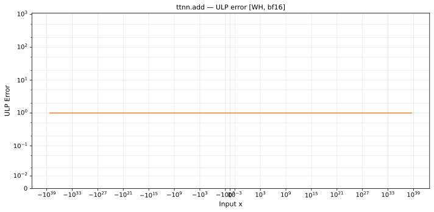

# add — Wormhole (WH), bfloat16
_This page is auto-generated by `ttnn-accuracy report`. Do not edit manually._

**Architecture:** Wormhole (WH)  
**Data type:** bfloat16  

---

[← Wormhole (WH) bfloat16 ops](README.md) | [All archs for add](../../../by_op/add/README.md) | [Top](../../../README.md)

**Measured input range:** all normal values  

| Parameters | Max ULP | Mean ULP | Max abs error |
|------------|---------|----------|---------------|
| `default` | 1 | 1 | 1.33e+36 |

**default** — within 2 ULP everywhere  

**Outcomes**

| Parameters | inexact | overflow |
|------------|------|------|
| `default` | 65,024 | 2 |

### Special values

| Variant | x | device | golden | |
|---|---|---|---|---|
| `default` | 0 | 1 | 1 | agree |
| `default` | -0 | 1 | 1 | agree |
| `default` | inf | inf | inf | agree |
| `default` | -inf | -inf | -inf | agree |
| `default` | nan | inf | nan | **differ** |
| `default` | 1.175e-38 | 1 | 1 | agree |
| `default` | -1.175e-38 | 1 | 1 | agree |

> **Provenance unknown.** These figures predate run tracking. Re-measure to attribute them.

