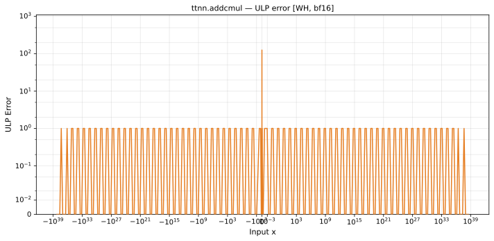

# addcmul — Wormhole (WH), bfloat16
_This page is auto-generated by `ttnn-accuracy report`. Do not edit manually._

**Architecture:** Wormhole (WH)  
**Data type:** bfloat16  

---

[← Wormhole (WH) bfloat16 ops](README.md) | [All archs for addcmul](../../../by_op/addcmul/README.md) | [Top](../../../README.md)

**Measured input range:** all normal values  

|  | `default` |
|---|---|
| Max ULP | 126 |
| Min ULP | 0.246 |
| Mean ULP | 19.4 |
| Signed bias (ULP) | -16.5 |
| p50 ULP | 0.498 |
| p95 ULP | 0.499 |
| p99 ULP | 31.5 |
| Exact fraction | 0.963 |
| Correctly rounded | 1 |
| Max abs error | 6.65e+35 |
| Max rel error | 0.984 |
| Median rel error | 0.036 |
| Bits of precision (worst) | 0.0226 |
| Bits of precision (median) | 4.79 |

**default** — worst sampled pairing  

**Outcomes**

| Parameters | exact | faithful | inexact | overflow |
|---|---|---|---|---|
| `default` | 62,612 | 620 | 1,792 | 2 |

**Worst points**

| Parameters | x | x2 | x3 | golden | device | ULP |
|---|---|---|---|---|---|---|
| `default` | 2.3326216e-38 | -0.061767578 | 1.8734441e-37 | 1.1754944e-38 | 2.3326216e-38 | 126 |
| `default` | 2.3418052e-38 | -0.061767578 | 1.8734441e-37 | 1.1846779e-38 | 2.3418052e-38 | 126 |
| `default` | 2.3509887e-38 | -0.061767578 | 1.8734441e-37 | 1.1938615e-38 | 2.3509887e-38 | 126 |
| `default` | 2.3693558e-38 | -0.061767578 | 1.8734441e-37 | 1.2122285e-38 | 2.3693558e-38 | 126 |
| `default` | 2.387723e-38 | -0.061767578 | 1.8734441e-37 | 1.2305956e-38 | 2.387723e-38 | 126 |
| `default` | 2.40609e-38 | -0.061767578 | 1.8734441e-37 | 1.2489627e-38 | 2.40609e-38 | 126 |
| `default` | 2.424457e-38 | -0.061767578 | 1.8734441e-37 | 1.2673298e-38 | 2.424457e-38 | 126 |
| `default` | 2.4428242e-38 | -0.061767578 | 1.8734441e-37 | 1.285697e-38 | 2.4428242e-38 | 126 |
| `default` | 2.4611913e-38 | -0.061767578 | 1.8734441e-37 | 1.304064e-38 | 2.4611913e-38 | 126 |
| `default` | 2.4795584e-38 | -0.061767578 | 1.8734441e-37 | 1.3224311e-38 | 2.4795584e-38 | 126 |

**Non-finite outputs**

| Parameters | Points | Both | Device only | Golden only | Device inf | Device nan | Golden inf | Golden nan |
|---|---|---|---|---|---|---|---|---|
| `default` | 2 | 2 | 0 | 0 | 2 | 0 | 2 | 0 |

| Parameters | x | x2 | x3 | golden | device |
|---|---|---|---|---|---|
| `default` | inf | 0 | 0 | inf | inf |
| `default` | -inf | 0 | 0 | -inf | -inf |

### Special values

| Variant | x | device | golden |  |
|---|---|---|---|---|
| `default` | 0 | 1 | 1 | agree |
| `default` | -0 | 1 | 1 | agree |
| `default` | inf | inf | inf | agree |
| `default` | -inf | -inf | -inf | agree |
| `default` | nan | inf | nan | **differ** |
| `default` | 1.1754944e-38 | 1 | 1 | agree |
| `default` | -1.1754944e-38 | 1 | 1 | agree |

> **Sampled, not exhaustive.** For this op the first operand is exhaustive; the second and third take every 512th bf16 code, 128 values each. The figures above are a lower bound on the error, and comparable between releases, but they are not a bound over the dtype.

_Measured on WORMHOLE_B0 · tt-metal `de546d3b146` · ttnn `0.79.0` · run `20261010T025808`_

