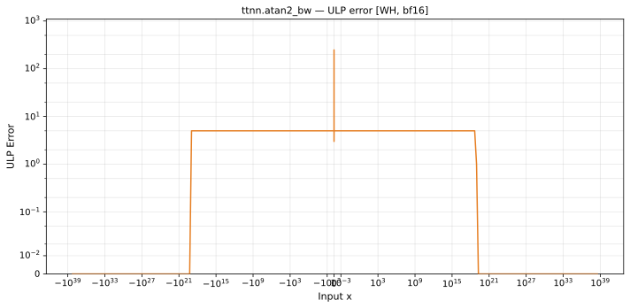

# atan2_bw — Wormhole (WH), bfloat16
_This page is auto-generated by `ttnn-accuracy report`. Do not edit manually._

_Generated: 2026-09-03 10:37_

**Architecture:** Wormhole (WH)  
**Data type:** bfloat16  

---

[← Wormhole (WH) bfloat16 ops](README.md) | [All archs for atan2_bw](../../../by_op/atan2_bw/README.md) | [Top](../../../README.md)

**Measured input range:** all normal values  

| Parameters | Max ULP | Mean ULP | Max abs error |
|------------|---------|----------|---------------|
| `default` | 248 | 4.92 | 4.47e+18 |

**default** — worst pairing 248 ULP; mean 4.92  

**Outcomes**

| Parameters | exact | inexact |
|------------|------|------|
| `default` | 16,642 | 48,384 |

### Special values

| Variant | x | device | golden | |
|---|---|---|---|---|
| `default` | 0 | 1 | 1 | agree |
| `default` | -0 | 1 | 1 | agree |
| `default` | inf | 0 | 0 | agree |
| `default` | -inf | 0 | 0 | agree |
| `default` | nan | 0 | nan | **differ** |
| `default` | 1.175e-38 | 1 | 1 | agree |
| `default` | -1.175e-38 | 1 | 1 | agree |

_Measured on WORMHOLE_B0 · tt-metal `812427269cb` · ttnn `0.1.dev30578+g5b8d933` · run `20260902T135808`_

