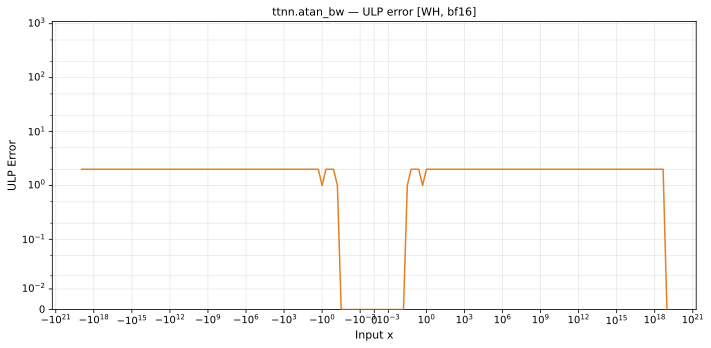

# atan_bw — Wormhole (WH), bfloat16
_This page is auto-generated by `ttnn-accuracy report`. Do not edit manually._

**Architecture:** Wormhole (WH)  
**Data type:** bfloat16  

---

[← Wormhole (WH) bfloat16 ops](README.md) | [All archs for atan_bw](../../../by_op/atan_bw/README.md) | [Top](../../../README.md)

**Measured input range:** x ∈ [-9.223e+18, 9.223e+18]  

| Parameters | Max ULP | Mean ULP | Accurate to \|x\| | Max abs error |
|---|---|---|---|---------------|
| `default` | 2 | 1.04 | 9.19e+18 | 0.00781 |

**default** — 2 of 48386 points returned inf or zero where a value exists  

**Outcomes**

| Parameters | exact | inexact | zeroed |
|------------|------|------|------|
| `default` | 41,332 | 7,052 | 2 |

### Special values

| Variant | x | device | golden | |
|---|---|---|---|---|
| `default` | 0 | 1 | 1 | agree |
| `default` | -0 | 1 | 1 | agree |
| `default` | inf | 0 | 0 | agree |
| `default` | -inf | 0 | 0 | agree |
| `default` | nan | 0 | nan | **differ** |
| `default` | 1.175e-38 | 1 | 1 | agree |
| `default` | -1.175e-38 | 1 | 1 | agree |

_Measured on WORMHOLE_B0 · tt-metal `9f9cd4fd590` · ttnn `0.77.0` · run `20260915T152226`_

