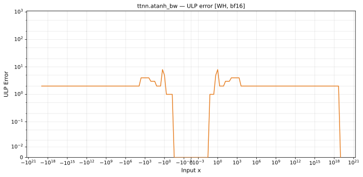

# atanh_bw — Wormhole (WH), bfloat16
_This page is auto-generated by `ttnn-accuracy report`. Do not edit manually._

**Architecture:** Wormhole (WH)  
**Data type:** bfloat16  

---

[← Wormhole (WH) bfloat16 ops](README.md) | [All archs for atanh_bw](../../../by_op/atanh_bw/README.md) | [Top](../../../README.md)

**Measured input range:** x ∈ [-9.223e+18, 9.223e+18]  

|  | `default` |
|---|---|
| Max ULP | 8.17 |
| Min ULP | 0 |
| Mean ULP | 1.02 |
| Signed bias (ULP) | 0.973 |
| p50 ULP | 0 |
| p95 ULP | 1.06 |
| p99 ULP | 1.95 |
| Exact fraction | 0.84 |
| Correctly rounded | 0.84 |
| Accurate to \|x\| | 0.82 |
| Max abs error | 0.289 |
| Max rel error | 0.042 |
| Median rel error | 0.00481 |
| Bits of precision (worst) | 4.58 |
| Bits of precision (median) | 7.7 |

**default** — 2/48386 defects; rest 8.17 ULP  

**Outcomes**

| Parameters | exact | faithful | inexact | overflow | zeroed |
|---|---|---|---|---|---|
| `default` | 40,634 | 5,052 | 2,696 | 2 | 2 |

**Worst points**

| Parameters | x | golden | device | ULP |
|---|---|---|---|---|
| `default` | 1.0703125 | -6.875 | -7.125 | 8.17 |
| `default` | -1.0703125 | -6.875 | -7.125 | 8.17 |
| `default` | 1.078125 | -6.15625 | -6.40625 | 7.9 |
| `default` | -1.078125 | -6.15625 | -6.40625 | 7.9 |
| `default` | 1.0625 | -7.75 | -8 | 7.76 |
| `default` | -1.0625 | -7.75 | -8 | 7.76 |
| `default` | 1.0859375 | -5.59375 | -5.8125 | 7.49 |
| `default` | -1.0859375 | -5.59375 | -5.8125 | 7.49 |
| `default` | 0.9140625 | 6.09375 | 5.9375 | 4.54 |
| `default` | -0.9140625 | 6.09375 | 5.9375 | 4.54 |

**Non-finite outputs**

| Parameters | Points | Both | Device only | Golden only | Device inf | Device nan | Golden inf | Golden nan |
|---|---|---|---|---|---|---|---|---|
| `default` | 2 | 2 | 0 | 0 | 2 | 0 | 2 | 0 |

| Parameters | x | golden | device |
|---|---|---|---|
| `default` | 1 | inf | inf |
| `default` | -1 | inf | inf |

### Special values

| Variant | x | device | golden |  |
|---|---|---|---|---|
| `default` | 0 | 1 | 1 | agree |
| `default` | -0 | 1 | 1 | agree |
| `default` | inf | 0 | -0 | **differ** |
| `default` | -inf | 0 | -0 | **differ** |
| `default` | nan | 0 | nan | **differ** |
| `default` | 1.1754944e-38 | 1 | 1 | agree |
| `default` | -1.1754944e-38 | 1 | 1 | agree |

_Measured on WORMHOLE_B0 · tt-metal `de546d3b146` · ttnn `0.79.0` · run `20261010T025807`_

