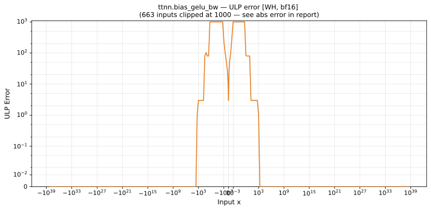

# bias_gelu_bw — Wormhole (WH), bfloat16
_This page is auto-generated by `ttnn-accuracy report`. Do not edit manually._

_Generated: 2026-09-03 10:37_

**Architecture:** Wormhole (WH)  
**Data type:** bfloat16  

---

[← Wormhole (WH) bfloat16 ops](README.md) | [All archs for bias_gelu_bw](../../../by_op/bias_gelu_bw/README.md) | [Top](../../../README.md)

**Measured input range:** all normal values  

| Parameters | Max ULP | Mean ULP | Max abs error |
|------------|---------|----------|---------------|
| `default` | 2.45e+05 ⚠ | 93.8 | 0.000947 |

**default** — worst pairing 2.45e+05 ULP; mean 93.8  

**Outcomes**

| Parameters | exact | inexact | mismatch |
|------------|------|------|------|
| `default` | 30,207 | 34,817 | 2 |

> **Provenance unknown.** These figures predate run tracking. Re-measure to attribute them.

