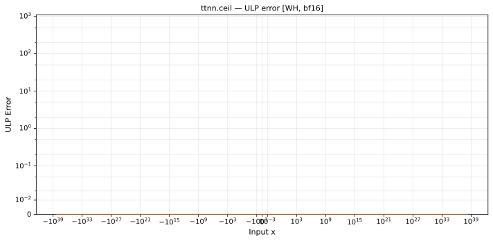

# ceil — Wormhole (WH), bfloat16
_This page is auto-generated by `scripts/generate_reports.py`. Do not edit manually._

_Generated: 2026-04-28 09:42 UTC_

**Operation:** `ceil`  
**Architecture:** Wormhole (WH)  
**Data type:** bfloat16  

---

[← Wormhole (WH) bfloat16 ops](README.md) | [All archs for ceil](../../../by_op/ceil/README.md) | [Top](../../../README.md)

## Variant: `default`

| Metric | Value |
|--------|-------|
| Max ULP error (display range) | 0 |
| Mean ULP error (display range) | 0 |
| Max absolute error | 0 |

