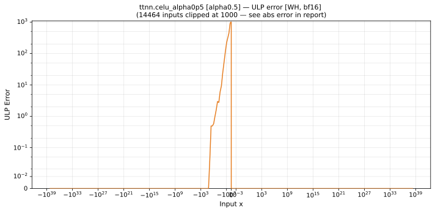
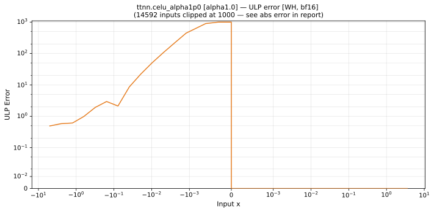
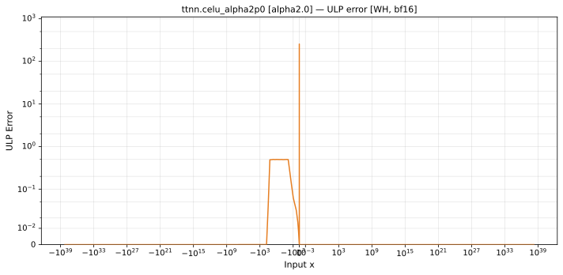

# celu — Wormhole (WH), bfloat16
_This page is auto-generated by `scripts/generate_reports.py`. Do not edit manually._

_Generated: 2026-04-28 12:23 UTC_

**Architecture:** Wormhole (WH)  
**Data type:** bfloat16  

---

[← Wormhole (WH) bfloat16 ops](README.md) | [All archs for celu](../../../by_op/celu/README.md) | [Top](../../../README.md)

| Parameters | Max ULP | Mean ULP | Max abs error |
|------------|---------|----------|---------------|
| `alpha=0.5` | 9.39e+36 ⚠ | 7.29e+34 | 0.00119 |
| `alpha=1.0` | 1.88e+37 ⚠ | 1.46e+35 | 0.00239 |
| `alpha=2.0` | 3.76e+37 ⚠ | 2.92e+35 | 0.00478 |

### `alpha=0.5`

### `alpha=1.0`

### `alpha=2.0`

