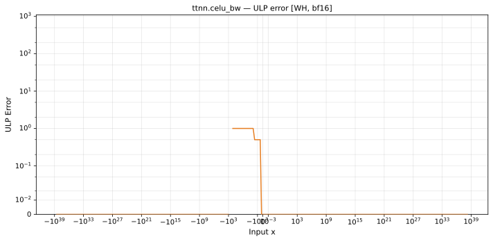

# celu_bw — Wormhole (WH), bfloat16
_This page is auto-generated by `ttnn-accuracy report`. Do not edit manually._

**Architecture:** Wormhole (WH)  
**Data type:** bfloat16  

---

[← Wormhole (WH) bfloat16 ops](README.md) | [All archs for celu_bw](../../../by_op/celu_bw/README.md) | [Top](../../../README.md)

**Measured input range:** x ∈ [-3.39e+38, 3.39e+38]  

|  | `default` |
|---|---|
| Max ULP | 0.892 |
| Min ULP | 0 |
| Mean ULP | 0.52 |
| Signed bias (ULP) | 0.148 |
| p50 ULP | 0 |
| p95 ULP | 0.000267 |
| p99 ULP | 0.43 |
| Exact fraction | 0.989 |
| Correctly rounded | 0.994 |
| Accurate to \|x\| | 3.39e+38 |
| Max abs error | 0.00355 |
| Max rel error | 0.00516 |
| Median rel error | 0.00303 |
| Bits of precision (worst) | 7.6 |
| Bits of precision (median) | 8.37 |

**default** — faithful; 734/65024 tie-breaks  

**Outcomes**

| Parameters | exact | faithful | flushed |
|---|---|---|---|
| `default` | 63,894 | 734 | 396 |

**Worst points**

| Parameters | x | golden | device | ULP |
|---|---|---|---|---|
| `default` | -31.375 | 2.364775e-14 | 2.3758773e-14 | 0.892 |
| `default` | -0.890625 | 0.41015625 | 0.41210938 | 0.876 |
| `default` | -0.20703125 | 0.8125 | 0.81640625 | 0.873 |
| `default` | -0.0044555664 | 0.99609375 | 0.9921875 | 0.862 |
| `default` | -2.984375 | 0.05053711 | 0.05078125 | 0.861 |
| `default` | -18.875 | 6.344635e-09 | 6.373739e-09 | 0.857 |
| `default` | -0.20214844 | 0.81640625 | 0.8203125 | 0.855 |
| `default` | -0.004486084 | 0.99609375 | 0.9921875 | 0.854 |
| `default` | -7.8125 | 0.0004043579 | 0.00040626526 | 0.849 |
| `default` | -0.17382812 | 0.83984375 | 0.84375 | 0.847 |

**Monotonicity**

_Checked only where the reference is itself ordered, and never across a discontinuity._

| Parameters | Pairs | Violations | Rate | Worst \|Δy\| |
|---|---|---|---|---|
| `default` | 64,625 | 0 | 0 | 0 |

### Special values

| Variant | x | device | golden |  |
|---|---|---|---|---|
| `default` | 0 | 1 | 1 | agree |
| `default` | -0 | 1 | 1 | agree |
| `default` | inf | 1 | 1 | agree |
| `default` | -inf | 0 | 0 | agree |
| `default` | nan | inf | nan | **differ** |
| `default` | 1.1754944e-38 | 1 | 1 | agree |
| `default` | -1.1754944e-38 | 1 | 1 | agree |

> **Provenance unknown.** These figures predate run tracking. Re-measure to attribute them.

