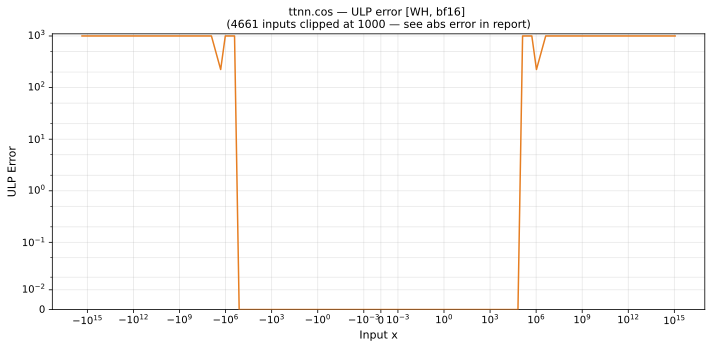

# cos — Wormhole (WH), bfloat16
_This page is auto-generated by `ttnn-accuracy report`. Do not edit manually._

_Generated: 2026-08-27 12:58_

**Architecture:** Wormhole (WH)  
**Data type:** bfloat16  
**Valid domain:** BF16 argument reduction is undefined for |x| > ~128  

---

[← Wormhole (WH) bfloat16 ops](README.md) | [All archs for cos](../../../by_op/cos/README.md) | [Top](../../../README.md)

**Measured input range:** x ∈ [-128, 128]  

| Parameters | Max ULP | Mean ULP | Accurate to \|x\| | Max abs error |
|------------|---------|----------|-----------------|---------------|
| `default` | 2.96e+38 ⚠ | 2.71e+36 | 1.31e+05 | 3.34e+38 |

**Outcomes**

| Parameters | exact | inexact | mismatch |
|------------|------|------|------|
| `default` | 36,761 | 6,989 | 21,274 |

_Measured on WORMHOLE_B0 · tt-metal `a5cd86212e1` · ttnn `0.75.0rc10.dev817+g2adf8c65887` · run `20260827T120147`_

