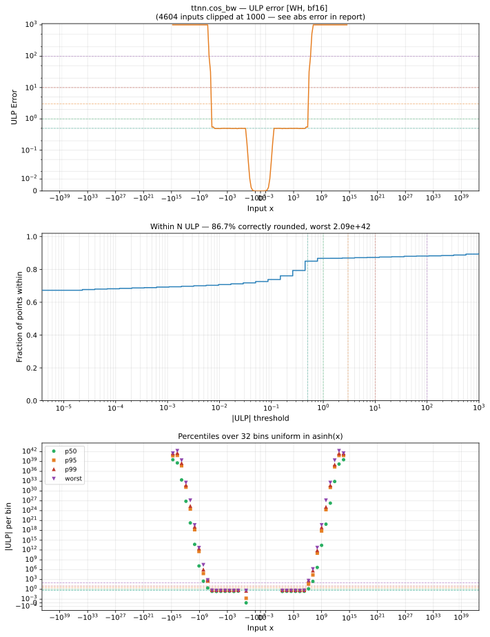

# cos_bw — Wormhole (WH), bfloat16
_This page is auto-generated by `ttnn-accuracy report`. Do not edit manually._

**Architecture:** Wormhole (WH)  
**Data type:** bfloat16  

---

[← Wormhole (WH) bfloat16 ops](README.md) | [All archs for cos_bw](../../../by_op/cos_bw/README.md) | [Top](../../../README.md)

**Measured input range:** x ∈ [-3.39e+38, 3.39e+38]  

|  | `default` |
|---|---|
| Max ULP | 2.09e+42 ⚠ |
| Min ULP | 0 |
| Mean ULP | 2.59e+39 |
| Signed bias (ULP) | -5.41e+37 |
| p50 ULP | 0 |
| p95 ULP | 1.35e+23 |
| p99 ULP | 3.19e+37 |
| Exact fraction | 0.866 |
| Correctly rounded | 0.867 |
| Accurate to \|x\| | 2.15e+06 |
| Max abs error | 3.32e+38 |
| Max rel error | 1.29e+40 |
| Median rel error | 5.71e+14 |
| Bits of precision (worst) | -133 |
| Bits of precision (median) | -49 |

**default** — 21281/65024 defects; rest 2.09e+42 ULP  

**Outcomes**

| Parameters | exact | faithful | inexact | mismatch |
|---|---|---|---|---|
| `default` | 37,902 | 41 | 5,800 | 21,281 |

**Worst points**

| Parameters | x | golden | device | ULP |
|---|---|---|---|---|
| `default` | 2.7900108e+13 | -0.0024719238 | -3.1901472e+37 | 2.09e+42 |
| `default` | -2.7900108e+13 | 0.0024719238 | 3.1901472e+37 | 2.09e+42 |
| `default` | 4.5629733e+13 | -0.057861328 | 2.7249174e+38 | 1.12e+42 |
| `default` | -4.5629733e+13 | 0.057861328 | -2.7249174e+38 | 1.12e+42 |
| `default` | 1.5874199e+13 | -0.055419922 | -1.3823971e+38 | 5.66e+41 |
| `default` | -1.5874199e+13 | 0.055419922 | 1.3823971e+38 | 5.66e+41 |
| `default` | 6.5970698e+13 | 0.067871094 | -1.8875038e+38 | 3.87e+41 |
| `default` | -6.5970698e+13 | -0.067871094 | 1.8875038e+38 | 3.87e+41 |
| `default` | 1.0170483e+13 | 0.06298828 | -8.3741364e+37 | 1.72e+41 |
| `default` | -1.0170483e+13 | -0.06298828 | 8.3741364e+37 | 1.72e+41 |

**Non-finite outputs**

| Parameters | Points | Both | Device only | Golden only | Device inf | Device nan | Golden inf | Golden nan |
|---|---|---|---|---|---|---|---|---|
| `default` | 21,281 | 0 | 21,281 | 0 | 21,281 | 0 | 0 | 0 |

| Parameters | x | golden | device |
|---|---|---|---|
| `default` | 1.3881334e+13 | -0.16796875 | -inf |
| `default` | 1.4018773e+13 | -0.17089844 | inf |
| `default` | 1.4156212e+13 | 0.49023438 | -inf |
| `default` | 1.4293651e+13 | -0.75390625 | inf |
| `default` | 1.443109e+13 | 0.9296875 | -inf |
| `default` | 1.4568529e+13 | -1 | inf |
| `default` | 1.6011638e+13 | 0.38671875 | inf |
| `default` | 1.6286516e+13 | 0.87890625 | inf |
| `default` | 1.6423955e+13 | -0.98828125 | -inf |
| `default` | 1.6561394e+13 | 0.984375 | inf |

### Special values

| Variant | x | device | golden |  |
|---|---|---|---|---|
| `default` | 0 | 0 | -0 | **differ** |
| `default` | -0 | 0 | 0 | agree |
| `default` | inf | -inf | nan | **differ** |
| `default` | -inf | inf | nan | **differ** |
| `default` | nan | inf | nan | **differ** |
| `default` | 1.1754944e-38 | -1.1754944e-38 | -1.1754944e-38 | agree |
| `default` | -1.1754944e-38 | 1.1754944e-38 | 1.1754944e-38 | agree |

_Measured on WORMHOLE_B0 · tt-metal `de546d3b146` · ttnn `0.79.0` · run `20261003T030514`_

