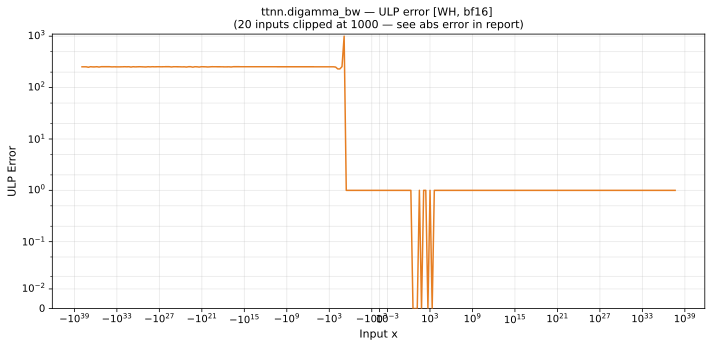

# digamma_bw — Wormhole (WH), bfloat16
_This page is auto-generated by `ttnn-accuracy report`. Do not edit manually._

**Architecture:** Wormhole (WH)  
**Data type:** bfloat16  

---

[← Wormhole (WH) bfloat16 ops](README.md) | [All archs for digamma_bw](../../../by_op/digamma_bw/README.md) | [Top](../../../README.md)

**Measured input range:** x ∈ [-3.39e+38, 8.507e+37]  

|  | `default` |
|---|---|
| Max ULP | 1.02e+08 ⚠ |
| Min ULP | 0 |
| Mean ULP | 1.32e+04 |
| Signed bias (ULP) | 174 |
| p50 ULP | 0.374 |
| p95 ULP | 227 |
| p99 ULP | 250 |
| Exact fraction | 0.664 |
| Correctly rounded | 0.664 |
| Accurate to \|x\| | 1 |
| Max abs error | 6.44e+36 |
| Max rel error | 7.96e+05 |
| Median rel error | 1 |
| Bits of precision (worst) | -19.6 |
| Bits of precision (median) | -0 |

**default** — 263/64769 defects; rest 1.02e+08 ULP  

**Outcomes**

| Parameters | exact | faithful | inexact | mismatch | overflow | zeroed |
|---|---|---|---|---|---|---|
| `default` | 32,294 | 508 | 15,830 | 6 | 15,874 | 257 |

**Worst points**

| Parameters | x | golden | device | ULP |
|---|---|---|---|---|
| `default` | -6.03125 | 1024 | -817889300 | 1.02e+08 |
| `default` | -5.96875 | 1024 | 817889300 | 1.02e+08 |
| `default` | -6.0625 | 260 | -6356992 | 3.18e+06 |
| `default` | -5.9375 | 260 | 6356992 | 3.18e+06 |
| `default` | -5.90625 | 117 | 370688 | 7.41e+05 |
| `default` | -6.09375 | 117 | -368640 | 7.38e+05 |
| `default` | -6.125 | 67 | -48896 | 9.79e+04 |
| `default` | -5.875 | 67 | 48896 | 9.77e+04 |
| `default` | -6.15625 | 44.25 | -10112 | 4.06e+04 |
| `default` | -5.84375 | 44.25 | 10176 | 4.05e+04 |

**Monotonicity**

_Checked only where the reference is itself ordered, and never across a discontinuity._

| Parameters | Pairs | Violations | Rate | Worst \|Δy\| |
|---|---|---|---|---|
| `default` | 24,318 | 0 | 0 | 0 |

**Non-finite outputs**

| Parameters | Points | Both | Device only | Golden only | Device inf | Device nan | Golden inf | Golden nan |
|---|---|---|---|---|---|---|---|---|
| `default` | 15,880 | 15,874 | 6 | 0 | 15,880 | 0 | 15,874 | 0 |

| Parameters | x | golden | device |
|---|---|---|---|
| `default` | 1.1754944e-38 | inf | inf |
| `default` | 1.1846779e-38 | inf | inf |
| `default` | 1.1938615e-38 | inf | inf |
| `default` | 1.203045e-38 | inf | inf |
| `default` | 1.2122285e-38 | inf | inf |
| `default` | 1.2214121e-38 | inf | inf |
| `default` | 1.2305956e-38 | inf | inf |
| `default` | 1.2397792e-38 | inf | inf |
| `default` | 1.2489627e-38 | inf | inf |
| `default` | 1.2581463e-38 | inf | inf |

### Special values

| Variant | x | device | golden |  |
|---|---|---|---|---|
| `default` | 0 | inf | inf | agree |
| `default` | -0 | inf | inf | agree |
| `default` | inf | 0 | 0 | agree |
| `default` | -inf | 0 | nan | **differ** |
| `default` | nan | 0 | nan | **differ** |
| `default` | 1.1754944e-38 | inf | inf | agree |
| `default` | -1.1754944e-38 | inf | inf | agree |

> **Provenance unknown.** These figures predate run tracking. Re-measure to attribute them.

