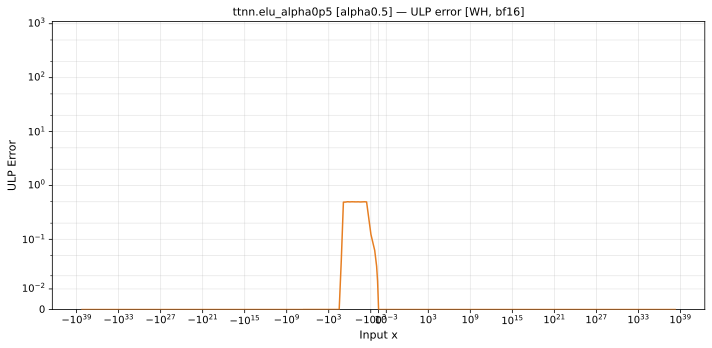

# elu — Wormhole (WH), bfloat16
_This page is auto-generated by `scripts/generate_reports.py`. Do not edit manually._

_Generated: 2026-04-28 09:42 UTC_

**Operation:** `elu_alpha0p5`  
**Architecture:** Wormhole (WH)  
**Data type:** bfloat16  
**Notes:** ELU alpha=0.5  

---

[← Wormhole (WH) bfloat16 ops](README.md) | [All archs for elu](../../../by_op/elu_alpha0p5/README.md) | [Top](../../../README.md)

## Variant: `alpha0.5`

| Metric | Value |
|--------|-------|
| Max ULP error (display range) | 8.62e+34 ⚠ (14593 groups > 1000 ULP, see max abs error) |
| Mean ULP error (display range) | 3.25e+33 |
| Max absolute error | 0.00119 |

