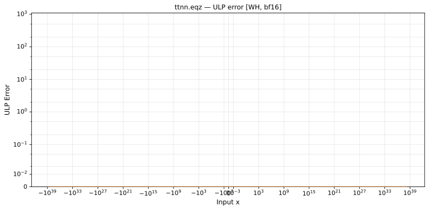

# eqz — Wormhole (WH), bfloat16
_This page is auto-generated by `ttnn-accuracy report`. Do not edit manually._

**Architecture:** Wormhole (WH)  
**Data type:** bfloat16  

---

[← Wormhole (WH) bfloat16 ops](README.md) | [All archs for eqz](../../../by_op/eqz/README.md) | [Top](../../../README.md)

**Measured input range:** x ∈ [-3.39e+38, 3.39e+38]  

| Parameters | Max ULP | Mean ULP | Accurate to \|x\| | Max abs error |
|---|---|---|---|---------------|
| `default` | 0 | — | 3.39e+38 | 0 |

**default** — bit-exact  

**Outcomes**

| Parameters | exact |
|------------|------|
| `default` | 65,024 |

### Special values

| Variant | x | device | golden | |
|---|---|---|---|---|
| `default` | 0 | 1 | 1 | agree |
| `default` | -0 | 1 | 1 | agree |
| `default` | inf | 0 | 0 | agree |
| `default` | -inf | 0 | 0 | agree |
| `default` | nan | 0 | 0 | agree |
| `default` | 1.175e-38 | 0 | 0 | agree |
| `default` | -1.175e-38 | 0 | 0 | agree |

> **Provenance unknown.** These figures predate run tracking. Re-measure to attribute them.

