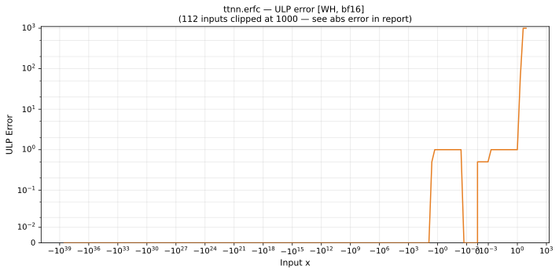

# erfc — Wormhole (WH), bfloat16
_This page is auto-generated by `ttnn-accuracy report`. Do not edit manually._

**Architecture:** Wormhole (WH)  
**Data type:** bfloat16  

---

[← Wormhole (WH) bfloat16 ops](README.md) | [All archs for erfc](../../../by_op/erfc/README.md) | [Top](../../../README.md)

**Measured input range:** x ∈ [-3.39e+38, 3.39e+38]  

|  | `default` |
|---|---|
| Max ULP | 3.19e+28 ⚠ |
| Min ULP | 0 |
| Mean ULP | 3.23e+24 |
| Signed bias (ULP) | -3.23e+24 |
| p50 ULP | 0 |
| p95 ULP | 0.5 |
| p99 ULP | 0.91 |
| Exact fraction | 0.662 |
| Correctly rounded | 0.969 |
| Accurate to \|x\| | 2.5 |
| Max abs error | 0.00781 |
| Max rel error | 2.19e+26 |
| Median rel error | 0.00391 |
| Bits of precision (worst) | -87.5 |
| Bits of precision (median) | 8 |

**default** — 198/65024 unflushed; rest 3.19e+28 ULP  

**Outcomes**

| Parameters | exact | faithful | inexact | unflushed |
|---|---|---|---|---|
| `default` | 32,472 | 3,411 | 28,943 | 198 |

**Worst points**

| Parameters | x | golden | device | ULP |
|---|---|---|---|---|
| `default` | 9.1875 | 1.3407982e-38 | 2.927436e-12 | 3.19e+28 |
| `default` | 9.125 | 4.2428e-38 | 2.927436e-12 | 1.59e+28 |
| `default` | 9.0625 | 1.329778e-37 | 2.927436e-12 | 3.98e+27 |
| `default` | 9 | 4.1436176e-37 | 2.927436e-12 | 9.96e+26 |
| `default` | 8.9375 | 1.2754114e-36 | 2.927436e-12 | 4.98e+26 |
| `default` | 8.875 | 3.926151e-36 | 2.927436e-12 | 1.25e+26 |
| `default` | 8.8125 | 1.1896003e-35 | 2.927436e-12 | 6.23e+25 |
| `default` | 8.75 | 3.5923107e-35 | 2.927436e-12 | 1.56e+25 |
| `default` | 8.6875 | 1.0758124e-34 | 2.927436e-12 | 3.89e+24 |
| `default` | 8.625 | 3.2048678e-34 | 2.927436e-12 | 1.95e+24 |

**Monotonicity**

_Checked only where the reference is itself ordered, and never across a discontinuity._

| Parameters | Pairs | Violations | Rate | Worst \|Δy\| |
|---|---|---|---|---|
| `default` | 64,823 | 2 | 3.09e-05 | 6.29e-05 |

_Worst violations — the device output moved against the reference's own direction between these neighbouring inputs._

| Parameters | x | device | \|Δy\| |
|---|---|---|---|
| `default` | 2.484375 → 2.5 | 0.00044059753 → 0.00050354004 | 6.29e-05 |
| `default` | 4.96875 → 5 | 2.145839e-12 → 2.927436e-12 | 7.82e-13 |

### Special values

| Variant | x | device | golden |  |
|---|---|---|---|---|
| `default` | 0 | 0.99609375 | 1 | **differ** |
| `default` | -0 | 1 | 1 | agree |
| `default` | inf | 2.927436e-12 | 0 | **differ** |
| `default` | -inf | 2 | 2 | agree |
| `default` | nan | 2.927436e-12 | nan | **differ** |
| `default` | 1.1754944e-38 | 0.99609375 | 1 | **differ** |
| `default` | -1.1754944e-38 | 1 | 1 | agree |

_Measured on WORMHOLE_B0 · tt-metal `de546d3b146` · ttnn `0.79.0` · run `20261003T030251`_

