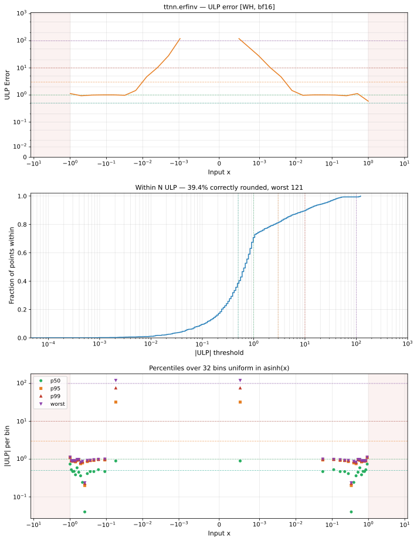

# erfinv — Wormhole (WH), bfloat16
_This page is auto-generated by `scripts/generate_reports.py`. Do not edit manually._

_Generated: 2026-04-28 11:29 UTC_

**Architecture:** Wormhole (WH)  
**Data type:** bfloat16  
**Valid domain:** x ∈ (-1, 1)  

---

[← Wormhole (WH) bfloat16 ops](README.md) | [All archs for erfinv](../../../by_op/erfinv/README.md) | [Top](../../../README.md)

| Parameters | Max ULP | Mean ULP | Max abs error |
|------------|---------|----------|---------------|
| `default` | 255 | 175 | 0.0092 |

