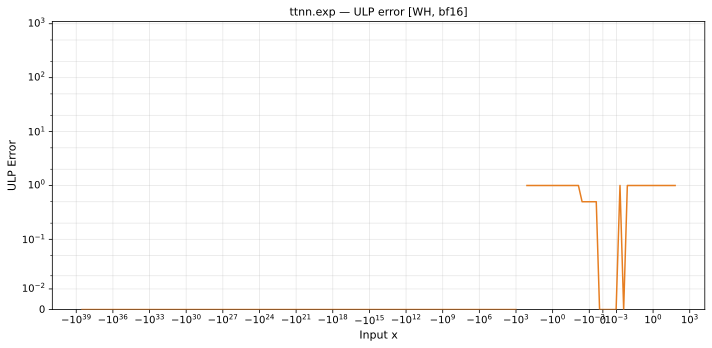
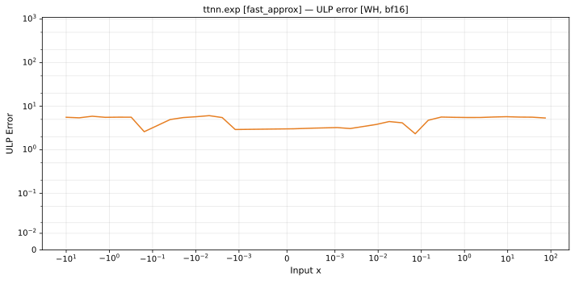

# exp — Wormhole (WH), bfloat16
_This page is auto-generated by `scripts/generate_reports.py`. Do not edit manually._

_Generated: 2026-04-29 07:49 UTC_

**Architecture:** Wormhole (WH)  
**Data type:** bfloat16  
**Valid domain:** x > ~88 overflows fp32  

---

[← Wormhole (WH) bfloat16 ops](README.md) | [All archs for exp](../../../by_op/exp/README.md) | [Top](../../../README.md)

**Measured input range:** x ≤ 88  

| Parameters | Max ULP | Mean ULP | Max abs error |
|------------|---------|----------|---------------|
| `default` | 0.894 | 0.0286 | 4.85e+35 |
| `fast_approx` | 6.08 | 2.08 | 2.33e+36 |

### `default`

### `fast_approx`

