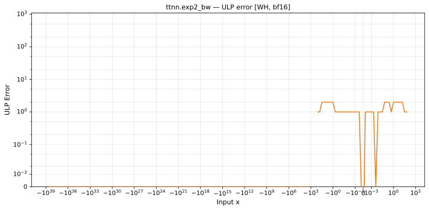

# exp2_bw — Wormhole (WH), bfloat16
_This page is auto-generated by `scripts/generate_reports.py`. Do not edit manually._

_Generated: 2026-04-27 14:02 UTC_

**Operation:** `exp2_bw`  
**Architecture:** Wormhole (WH)  
**Data type:** bfloat16  

---

[← Wormhole (WH) bfloat16 ops](README.md) | [All archs for exp2_bw](../../../by_op/exp2_bw/README.md) | [Top](../../../README.md)

## Variant: `default`

| Metric | Value |
|--------|-------|
| Max ULP error | inf |
| Mean ULP error | inf |
| Max absolute error | inf |

