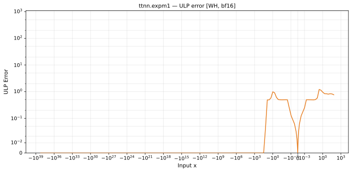

# expm1 — Wormhole (WH), bfloat16
_This page is auto-generated by `ttnn-accuracy report`. Do not edit manually._

**Architecture:** Wormhole (WH)  
**Data type:** bfloat16  

---

[← Wormhole (WH) bfloat16 ops](README.md) | [All archs for expm1](../../../by_op/expm1/README.md) | [Top](../../../README.md)

**Measured input range:** x ∈ [-3.39e+38, 88.5]  

| Parameters | Max ULP | Mean ULP | Accurate to \|x\| | Max abs error |
|---|---|---|---|---------------|
| `default` | 0 | — | 3.39e+38 | 0 |

**default** — bit-exact  

**Outcomes**

| Parameters | exact |
|------------|------|
| `default` | 49,458 |

### Special values

| Variant | x | device | golden | |
|---|---|---|---|---|
| `default` | 0 | 0 | 0 | agree |
| `default` | -0 | 0 | -0 | **differ** |
| `default` | inf | inf | inf | agree |
| `default` | -inf | -1 | -1 | agree |
| `default` | nan | inf | nan | **differ** |
| `default` | 1.175e-38 | 1.175e-38 | 1.175e-38 | agree |
| `default` | -1.175e-38 | -1.175e-38 | -1.175e-38 | agree |

_Measured on WORMHOLE_B0 · tt-metal `71e0727d990` · ttnn `0.1.dev30578+g5b8d933` · run `20260903T124708`_

