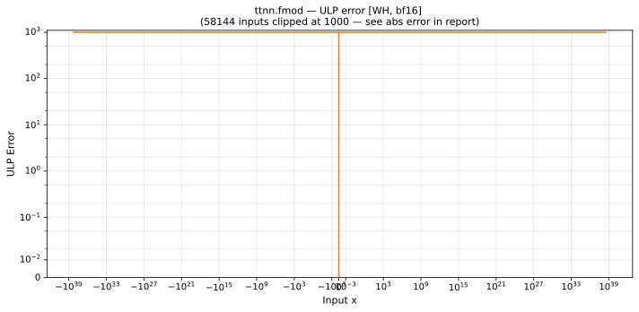

# fmod — Wormhole (WH), bfloat16
_This page is auto-generated by `ttnn-accuracy report`. Do not edit manually._

**Architecture:** Wormhole (WH)  
**Data type:** bfloat16  

---

[← Wormhole (WH) bfloat16 ops](README.md) | [All archs for fmod](../../../by_op/fmod/README.md) | [Top](../../../README.md)

**Measured input range:** all normal values  

|  | `default` |
|---|---|
| Max ULP | 6.65e+35 ⚠ |
| Min ULP | 0 |
| Mean ULP | 7.8e+34 |
| Signed bias (ULP) | 0 |
| p50 ULP | 2.6e+33 |
| p95 ULP | 3.32e+35 |
| p99 ULP | 6.65e+35 |
| Exact fraction | 0.0709 |
| Correctly rounded | 0.853 |
| Max abs error | 4.06e+31 |
| Max rel error | 5.19e+33 |
| Median rel error | 1.85e+32 |
| Bits of precision (worst) | -112 |
| Bits of precision (median) | -107 |

**default** — worst sampled pairing  

**Outcomes**

| Parameters | exact | inexact | undefined |
|---|---|---|---|
| `default` | 4,610 | 60,414 | 2 |

**Worst points**

| Parameters | x | x2 | golden | device | ULP |
|---|---|---|---|---|---|
| `default` | 784 | 2.6448623e-36 | 1.1754944e-38 | -6.1035156e-05 | 6.65e+35 |
| `default` | 900 | 2.8329414e-36 | 1.1754944e-38 | -6.1035156e-05 | 6.65e+35 |
| `default` | 984 | 2.9740007e-36 | 1.1754944e-38 | -6.1035156e-05 | 6.65e+35 |
| `default` | 1568 | 5.2897246e-36 | 2.3509887e-38 | -0.00012207031 | 6.65e+35 |
| `default` | 1800 | 5.6658828e-36 | 2.3509887e-38 | -0.00012207031 | 6.65e+35 |
| `default` | 1968 | 5.9480014e-36 | 2.3509887e-38 | -0.00012207031 | 6.65e+35 |
| `default` | 3136 | 1.0579449e-35 | 4.7019774e-38 | -0.00024414062 | 6.65e+35 |
| `default` | 3600 | 1.13317655e-35 | 4.7019774e-38 | -0.00024414062 | 6.65e+35 |
| `default` | 3936 | 1.1896003e-35 | 4.7019774e-38 | -0.00024414062 | 6.65e+35 |
| `default` | 6272 | 2.1158898e-35 | 9.403955e-38 | -0.00048828125 | 6.65e+35 |

**Non-finite outputs**

| Parameters | Points | Both | Device only | Golden only | Device inf | Device nan | Golden inf | Golden nan |
|---|---|---|---|---|---|---|---|---|
| `default` | 2 | 2 | 0 | 0 | 2 | 0 | 0 | 2 |

| Parameters | x | x2 | golden | device |
|---|---|---|---|---|
| `default` | inf | 0 | nan | inf |
| `default` | -inf | 0 | nan | inf |

### Special values

| Variant | x | device | golden |  |
|---|---|---|---|---|
| `default` | 0 | 0 | 0 | agree |
| `default` | -0 | 0 | -0 | **differ** |
| `default` | inf | -inf | nan | **differ** |
| `default` | -inf | inf | nan | **differ** |
| `default` | nan | -inf | nan | **differ** |
| `default` | 1.1754944e-38 | 1.1754944e-38 | 1.1754944e-38 | agree |
| `default` | -1.1754944e-38 | -1.1754944e-38 | -1.1754944e-38 | agree |

_Measured on WORMHOLE_B0 · tt-metal `de546d3b146` · ttnn `0.79.0` · run `20261003T030142`_

