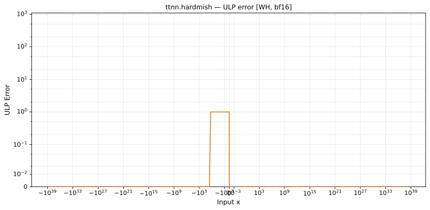

# hardmish — Wormhole (WH), bfloat16
_This page is auto-generated by `scripts/generate_reports.py`. Do not edit manually._

_Generated: 2026-04-28 09:24 UTC_

**Operation:** `hardmish`  
**Architecture:** Wormhole (WH)  
**Data type:** bfloat16  
**Notes:** uses hardswish as golden (hardmish ≈ hardswish)  

---

[← Wormhole (WH) bfloat16 ops](README.md) | [All archs for hardmish](../../../by_op/hardmish/README.md) | [Top](../../../README.md)

## Variant: `default`

| Metric | Value |
|--------|-------|
| Max ULP error (display range) | 255 |
| Mean ULP error (display range) | 177 |
| Max absolute error | 0.375 |

