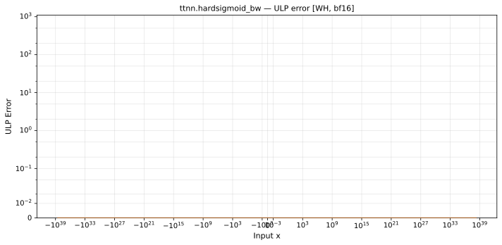

# hardsigmoid_bw — Wormhole (WH), bfloat16
_This page is auto-generated by `ttnn-accuracy report`. Do not edit manually._

**Architecture:** Wormhole (WH)  
**Data type:** bfloat16  

---

[← Wormhole (WH) bfloat16 ops](README.md) | [All archs for hardsigmoid_bw](../../../by_op/hardsigmoid_bw/README.md) | [Top](../../../README.md)

**Measured input range:** x ∈ [-3.39e+38, 3.39e+38]  

|  | `default` |
|---|---|
| Max ULP | 0.333 |
| Min ULP | 0 |
| Mean ULP | 0 |
| Signed bias (ULP) | 0 |
| p50 ULP | 0.333 |
| p95 ULP | 0.333 |
| p99 ULP | 0.333 |
| Exact fraction | 1 |
| Correctly rounded | 1 |
| Accurate to \|x\| | 3.39e+38 |
| Max abs error | 0.000326 |
| Max rel error | 0.00195 |
| Median rel error | 0 |
| Bits of precision (worst) | 9 |
| Bits of precision (median) | — |

**default** — bit-exact  

**Outcomes**

| Parameters | exact |
|---|---|
| `default` | 65,024 |

**Worst points**

| Parameters | x | golden | device | ULP |
|---|---|---|---|---|
| `default` | 1.1754944e-38 | 0.16699219 | 0.16699219 | 0.333 |
| `default` | 1.1846779e-38 | 0.16699219 | 0.16699219 | 0.333 |
| `default` | 1.1938615e-38 | 0.16699219 | 0.16699219 | 0.333 |
| `default` | 1.203045e-38 | 0.16699219 | 0.16699219 | 0.333 |
| `default` | 1.2122285e-38 | 0.16699219 | 0.16699219 | 0.333 |
| `default` | 1.2214121e-38 | 0.16699219 | 0.16699219 | 0.333 |
| `default` | 1.2305956e-38 | 0.16699219 | 0.16699219 | 0.333 |
| `default` | 1.2397792e-38 | 0.16699219 | 0.16699219 | 0.333 |
| `default` | 1.2489627e-38 | 0.16699219 | 0.16699219 | 0.333 |
| `default` | 1.2581463e-38 | 0.16699219 | 0.16699219 | 0.333 |

**Monotonicity**

_Checked only where the reference is itself ordered, and never across a discontinuity._

| Parameters | Pairs | Violations | Rate | Worst \|Δy\| |
|---|---|---|---|---|
| `default` | 65,022 | 0 | 0 | 0 |

### Special values

| Variant | x | device | golden |  |
|---|---|---|---|---|
| `default` | 0 | 0.16699219 | 0.16699219 | agree |
| `default` | -0 | 0.16699219 | 0.16699219 | agree |
| `default` | inf | 0 | 0 | agree |
| `default` | -inf | 0 | 0 | agree |
| `default` | nan | 0.16699219 | 0 | **differ** |
| `default` | 1.1754944e-38 | 0.16699219 | 0.16699219 | agree |
| `default` | -1.1754944e-38 | 0.16699219 | 0.16699219 | agree |

_Measured on WORMHOLE_B0 · tt-metal `a3a9fb4229a` · ttnn `0.78.0` · run `20260917T224646`_

